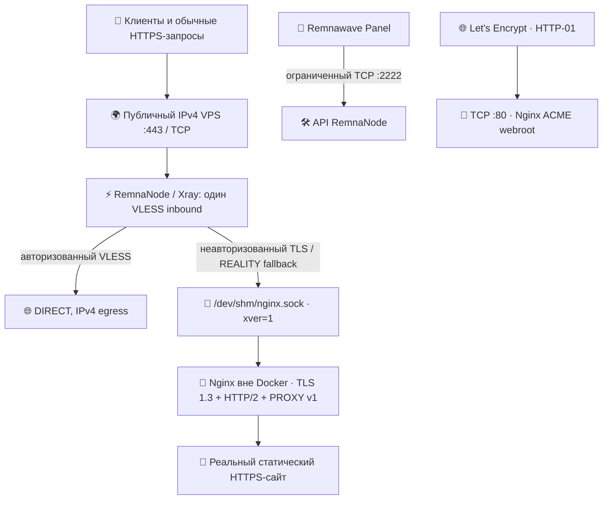

<div align="center">

# 🚀 VKARMANI · NODE INSTALL

**Production-oriented установщик выделенной Remnawave-ноды**

🛡️ IPv4-only · ⚡ VLESS REALITY · 🌐 Selfsteal Nginx · 🧩 RAW / XHTTP · 🔄 RKN Guard · 🧰 Диагностика и откат

**Версия установщика: `2.5.6` · Обновление документации: 09.10.2026**

[⚡ Установить](#install) · [🗺️ Карта проекта](#navigation) · [🔑 Remnawave](#panel) · [📋 RAW](#raw) · [🌐 XHTTP](#xhttp) · [🔐 Security](SECURITY.md) · [🛠️ Поддержка](#operations)

</div>

---

<a id="install"></a>
## ⚡ ГЛАВНАЯ КОМАНДА УСТАНОВКИ

> [!IMPORTANT]
> **Только для новой выделенной VPS**, НЕ для сервера панели/БД и НЕ для повторной установки поверх уже работающей ноды. Перед запуском нужны snapshot, проверенный доступ в консоль хостера и второй рабочий SSH-сеанс. Скрипт **меняет SSH, UFW, сетевые настройки, Docker, Nginx и GRUB**.

**Скопируйте блок целиком в SSH-терминал VPS.** Файл будет скачан по HTTPS из **неизменяемого Git-коммита**, проверен по жёстко закреплённой SHA256, синтаксису Bash и версии, сохранён на VPS и только затем запущен **без автоматического reboot**. `curl | bash` не используется.

```bash
sudo bash <<'VKARMANI_NODE_INSTALL_256'
set -Eeuo pipefail
set +x
umask 077
export LC_ALL=C LANG=C

[[ "$(id -u)" == 0 ]] || { echo 'Требуются права root.' >&2; exit 1; }
for tool in curl sha256sum mktemp install bash; do
  command -v "$tool" >/dev/null 2>&1 || { echo "Нет команды: $tool" >&2; exit 1; }
done

EXPECTED_SHA256="da745235274cee2ea89d5986e7107b5848d0ef2a8fa2767d3fba2a253b40041b"
RELEASE_COMMIT="eab5207032e3655b91b82b6b1c596f37457787e3"
URL="https://raw.githubusercontent.com/SUXARIK-GITHUB/Node_Install/${RELEASE_COMMIT}/install.sh"
WORK_DIR="$(mktemp -d /root/vkarmani-node-download.XXXXXXXX)"
trap 'rm -rf -- "$WORK_DIR"' EXIT

curl --fail --show-error --silent --location \
  --proto '=https' --proto-redir '=https' --tlsv1.2 \
  --connect-timeout 15 --max-time 180 --retry 3 --retry-delay 2 \
  "$URL" --output "$WORK_DIR/install.sh"
printf '%s  %s\n' "$EXPECTED_SHA256" "$WORK_DIR/install.sh" | sha256sum --check --status \
  || { echo 'STOP: неверный SHA256 установщика.' >&2; exit 1; }
bash -n "$WORK_DIR/install.sh"
[[ "$(bash "$WORK_DIR/install.sh" --version)" == "2.5.6" ]] \
  || { echo 'STOP: установщик имеет неверную версию.' >&2; exit 1; }

install -d -m 0700 /root/vkarmani-node-installer
install -m 0700 "$WORK_DIR/install.sh" /root/vkarmani-node-installer/install.sh
bash /root/vkarmani-node-installer/install.sh --no-reboot
VKARMANI_NODE_INSTALL_256
```

> [!NOTE]
> **Почему `--no-reboot`:** успешная установка сама по себе не подтверждает соединение Panel → Node и доступ пользователя из внешней сети. Сначала проверяем сервисы, SSH, сертификат и Selfsteal; перезагрузку выполняем контролируемо из консоли хостера. В обычном режиме без `--no-reboot` установщик планирует одну перезагрузку через 30 секунд.

### 🩹 Исправление финальной приёмки — 2.5.6

**Устранён воспроизведённый сценарий 2.5.5:** NTP успел синхронизироваться в начале установки, затем служба перезапустилась, а финальная одноразовая проверка попала в окно повторной синхронизации. Теперь приёмка ждёт **до 120 секунд** в `--preboot`/`--postboot` и до 35 секунд в остальных режимах; нужны **два последовательных успешных наблюдения** одной службы и одного источника. Не просто `active`: подтверждаются IPv4, синхронизация, настоящий неотброшенный NTP-ответ и стабильный `InvocationID`.

Если синхронизация не восстановилась в отведённое время, установка **не объявляется успешной и не перезагружает сервер**. Сохраняется контрольная точка финальной фазы. После устранения причины:

```bash
sudo bash /root/vkarmani-node-installer/install.sh --finish-install
```

Команда подходит **только для записанной финальной фазы 2.5.6**. Она повторяет приёмку, экспортирует существующие ключи, завершает RKN и фиксирует успех; не повторяет APT, SSH, установку Docker/Nginx или выпуск сертификатов. Повторный обычный запуск той же 2.5.6 с таким checkpoint тоже направляется сюда. При любом продолжении **авторебута нет**, даже если первый запуск был без `--no-reboot`.

> [!WARNING]
> Не запускайте новую первичную установку поверх работающей 2.5.5. Исправный `spite` уже восстановлен и не требует переустановки. Новая версия предназначена для следующих установок; она не заменяет уже установленные helpers на старых нодах. Произвольные незавершённые 2.5.5 и более старые состояния **не мигрируются** этим finish-режимом.

Полный разбор, границы доказательства, проверка и rollback: [🧯 NTP / finalization 2.5.6](docs/NTP_FINALIZATION_2.5.6.md).

### 🧾 Что вводить в терминал

При первичной установке появятся **ровно три запроса**; вставлять значения в команду или в публичный Git не нужно:

| Поле | Где взять | Примечание |
|:--|:--|:--|
| 🔑 `SECRET_KEY` | Remnawave Panel → параметры ноды | Ввод скрыт; хранится в закрытом `/etc/vkarmani-node/remnanode.env` |
| 🌍 Домен ноды | Собственный FQDN, например `node.example.com` | A-запись должна указывать на **IPv4 самой VPS**, без AAAA; Cloudflare **DNS only** |
| 🧭 IPv4 панели | Публичный **исходящий** адрес backend панели | Не подставляйте IP ноды вместо IP панели; используется в UFW-ACL и исключениях RKN Guard |

Ввод читается напрямую из `/dev/tty` — команда с heredoc сохраняет интерактивность. При удалённом SSH без терминала подключайтесь с `ssh -t`.

**После установки** выполните из сохранённого каталога (не скачивайте непроверенный новый `latest`):

```bash
sudo bash /root/vkarmani-node-installer/install.sh --check
sudo bash /root/vkarmani-node-installer/install.sh --backup
sudo nginx -t
sudo systemctl status nginx --no-pager
sudo docker compose -f /opt/vkarmani-node/compose.yaml ps
```

> 🧰 **Установка из ZIP:** скачайте полный архив этого выпуска, распакуйте `Node_Install/`, выполните `sha256sum --check SHA256SUMS`, `bash -n install.sh`, `bash install.sh --version`, затем `sudo bash install.sh --no-reboot`. Этот способ не зависит от доступности GitHub во время скачивания установщика. Подробности — [🔐 Security](SECURITY.md#supply).

---

<a id="navigation"></a>
## 🗺️ Карта проекта: куда перейти

| ⚡ Начало | 🌐 Подключение | 🔧 Эксплуатация | 🔐 Безопасность |
|:--|:--|:--|:--|
| [📦 Возможности](#features) | [🔑 Панель и Hosts](#panel) | [🛠️ Команды](#operations) | [🛡️ Security policy](SECURITY.md) |
| [✅ Требования](#requirements) | [📋 RAW + Vision](#raw) | [🔄 RKN Guard](#rkn) | [🔎 Угрозы и порты](SECURITY.md#threat) |
| [🧩 Архитектура](#architecture) | [🌐 XHTTP](#xhttp) | [🧬 Xray Core](#xray) | [🚨 Инциденты](SECURITY.md#incident) |
| [⚡ Установка](#install) | [🔀 Переключение](#switch) | [📈 Приёмка и rollback](#acceptance) | [📩 Сообщить об уязвимости](SECURITY.md#report) |

<a id="features"></a>
## 🧩 Что входит в Node_Install

| 🧱 Основа | 🌍 HTTPS и покрытие | 🛡️ Защита | 📋 Управление |
|:--|:--|:--|:--|
| Docker Compose / RemnaNode | Host Nginx Selfsteal | UFW / Fail2ban | `--check`, `--backup` |
| TCP/443 · один VLESS inbound | TLS 1.3 + HTTP/2 + Let's Encrypt | IPv4-only, DNS и routing | `--prepare-xhttp` |
| REALITY X25519 / ShortID | Unix-сокет и PROXY v1 | RKN Guard · ежедневный CIDR | Image/cover rollback |
| RAW+Vision **или** XHTTP | ACME HTTP-01 на TCP/80 | NET_ADMIN с явными ограничениями | `--xray-versions` |
| ⏱️ Ограниченное ожидание NTP | Без изменений Selfsteal | Контрольная точка финальной фазы | `--finish-install` |

**Границы ответственности:** установщик подготавливает **только ноду**. Создание объектов **Node, Host, Config Profile, Internal Squad, пользователей и подписок** выполняется в Remnawave Panel отдельно. Нода получает активный Xray Config Profile **от панели**, а локальные JSON в `/etc/vkarmani-node/` — шаблоны для импорта, **не** автоматически применяемая конфигурация.

<a id="requirements"></a>
## ✅ Требования и опасные изменения

| Что проверить | Требование и причина |
|:--|:--|
| 🐧 ОС | Выделенная чистая Ubuntu **22.04 / 24.04 / 26.04** или Debian **12 / 13**, поддерживаемая архитектура и обычный boot layout; все версии **не** подтверждены одинаковыми реальными VPS-тестами |
| 🖥️ Управление | Root/sudo, recovery/консоль хостера, подтверждённый пароль SSH; SSH-политика установщика — **password-only**, ключи могут быть отключены |
| 📦 Ресурсы | RAM/CPU/диск и свободное место для образа, Certbot и backups; проверяются preflight, см. [требования Remnawave](https://docs.rw/install/requirements/) |
| 🌐 IPv4 / DNS | Публичный IPv4 на интерфейсе VPS, одна A-запись домена, без AAAA; NAT-only и IPv6-only не подходят |
| 🔌 Порты | TCP/80 (ACME), TCP/443 (Xray), TCP/2222 (API ноды **только от IP панели**), SSH по сохранённому порту |
| 🧯 Snapshot | Snapshot VPS **до** запуска и доступ к восстановлению; backup внутри скрипта не заменяет snapshot диска |
| ⛔ Совместное ПО | Не ставить поверх панели, БД или других production-сервисов, управляющих UFW/Nginx/Docker/портом 443 |

> [!WARNING]
> Первичная установка меняет **SSH, UFW, Fail2ban, Nginx, Docker, GRUB, sysctl, systemd, NTP и сертификаты**. При конфликте неизвестного сервиса она должна остановиться; это не универсальный мигратор работающего сервера. Кросс-версионное `resume` без описанной миграции недопустимо.

<a id="architecture"></a>
## 🌐 Карта сети: Xray, REALITY, Nginx и Selfsteal



| Точка | Слушатель | Для чего | Что запрещено |
|:--|:--|:--|:--|
| **443/tcp** | Xray в RemnaNode (`network_mode: host`) | Выбранный RAW или XHTTP | Второй Xray/Nginx на публичном 443 |
| **Unix socket** | Nginx на **хосте**: `/run/vkarmani-selfsteal/nginx.sock` | REALITY fallback по `xver: 1` | Заменять сокет внешним `proxy_pass` без нового аудита |
| **В контейнере** | `/dev/shm/nginx.sock` (bind read-only) | Внутренний `target` REALITY | Монтировать TLS private key в контейнер |
| **80/tcp** | Host Nginx | ACME HTTP-01 и HTTP redirect | Блокировать HTTP-01 при выпуске/продлении сертификата |
| **2222/tcp** | RemnaNode API | Связь backend Panel → Node | `0.0.0.0/0` в allow-правиле панели |

**Selfsteal** — это не отдельный публичный HTTPS-прокси: Xray владеет 443, а REALITY передаёт неподходящее соединение в Nginx через приватный Unix-сокет с PROXY protocol v1. Nginx обслуживает настоящий HTTPS-сайт, проверяемый по TLS 1.3, ALPN (`h2`, `http/1.1`) и содержимому. Сертификаты Let's Encrypt хранятся на **хосте**, cert-deploy проверяет принятую Nginx версию leaf после graceful reload.

> [!CAUTION]
> Cover/REALITY **не гарантируют** незаметность для DPI и защиту от блокировок IPv4, диапазона провайдера или ASN. Не включайте Cloudflare **Proxied** для прямого REALITY/RAW в расчёте на «маскировку» без смены архитектуры. Для узкого TCP/443 не требуется UDP/443.

---

<a id="panel"></a>
## 🔑 Подключение к Remnawave Panel

1. Завершите установку на одной ноде и получите локальную инструкцию: `sudo cat /etc/vkarmani-node/PANEL-SETUP.txt` (только на вашей VPS).
2. В Panel создайте **Node**, используйте адрес/порт API ноды и `SECRET_KEY` из этой панели. Правило UFW на `2222/tcp` должно разрешать исходящий IPv4 именно **backend панели**.
3. Создайте/выберите **Config Profile**. В активном Xray-конфиге должен быть **один клиентский VLESS inbound на TCP/443**. Служебный inbound Xray, добавляемый RemnaNode, — отдельный компонент.
4. В **Hosts** привяжите правильный `inboundTag`, публичный адрес/домен ноды, SNI/REALITY параметры и, если выбран XHTTP, HTTP `host/path/mode`. Затем назначьте Internal Squads, пользователей и подписки.
5. Проверьте **реальный** Panel → Node и авторизованного клиента. `docker ps` и успешный тест сертификата не доказывают эти внешние пути.

### 🎛️ Какие поля обязаны совпасть

| Параметр | RAW ↔ XHTTP | Источник истины |
|:--|:--|:--|
| `tag` / `inboundTag` | **Один и тот же** при замене inbound | Существующий Host + профиль панели |
| `listen`, `port` | `0.0.0.0`, `443/tcp` | Схема VPS/порта Xray |
| `privateKey`, `shortIds`, `serverNames` | **Те же** на этой VPS | Закрытые файлы `/etc/vkarmani-node/` |
| `target`, `xver` | `/dev/shm/nginx.sock`, `1` | Контракт Nginx Selfsteal |
| `settings.flow` | RAW: `xtls-rprx-vision`, XHTTP: `""` | Выбранный транспорт и клиентский формат |
| `xhttpSettings` | Только у XHTTP: `host`, `path`, `mode` | Приватный XHTTP-шаблон VPS |
| DNS/routing | При переключении **не обязаны меняться** | Проверенный Config Profile этой ноды |

**Используйте реальные JSON из VPS**, а не учебные ключи ниже. Файл `profile.json` создаётся установщиком. Для XHTTP на уже установленной совместимой ноде предварительно запустите `sudo bash /root/vkarmani-node-installer/install.sh --prepare-xhttp` (или проверенный `install.sh` из архива): полученный `profile-xhttp.json` содержит тот же PRIVATE key и проверенные настройки.

<a id="inbounds"></a>
## 📋 Два полноценных Xray-профиля для панели

Ниже — **полные JSON-документы**, содержащие `log`, `dns`, `inbounds`, `outbounds`, `routing`, а не обрезанные фрагменты одного inbound. Они включают дополнительные IPv4 DNS/egress-проверки по мотивам предоставленной конфигурации: `serveStale`, `serveExpiredTTL`, `enableParallelQuery`, `geosite:private`, `geoip:private`, BitTorrent и `freedom.finalRules`.

> [!IMPORTANT]
> Это **расширенные публичные примеры для ручного изучения/тестирования**, а не автоматические рабочие файлы инсталлера. Стандартные `/etc/vkarmani-node/profile*.json` сохраняют проверенный генератор. Дополнительные параметры проверены по схемам Xray Core, но **не проходили реальный Xray runtime-тест на каждой VPS**, поэтому изменение DNS/routing/finalRules требует `rw-core run -test` на staging и проверки исходящих соединений. Не добавляйте эти правила одновременно с неосмотренными правилами Panel/API.

| 🔐 Значение-заглушка | Что подставлять в панели |
|:--|:--|
| `node.example.com` | Настоящий FQDN конкретной ноды (домен должен обслуживаться Selfsteal и иметь A-запись) |
| `VK_RAW_REALITY_REPLACE_WITH_NODE_TAG` | Не придумывать заново: взять **реальный tag** текущего inbound/Host |
| `REPLACE_WITH_PRIVATE_KEY_FROM_NODE` | REALITY `privateKey` только из файлов **этой** VPS |
| `REPLACE_WITH_SHORT_ID_FROM_NODE` | Правильный hex `shortIds` из той же VPS |
| `/REPLACE_WITH_NODE_GENERATED_XHTTP_PATH` | Путь из **`profile-xhttp.json`**; у клиента такой же |
| `203.0.113.10/32`, `198.51.100.20/32` | **Учебные RFC 5737** IP ноды и панели; в реальном профиле должны быть actual IP |
| `clients: []` | Пользователей назначает Remnawave; **не** публикуйте UUID/токены |

<a id="raw"></a>
### ⚡ Вариант A: VLESS + RAW + REALITY + Vision

**Назначение:** текущая производительная схема, на которой работают существующие ноды. `flow=xtls-rprx-vision` относится к RAW, не к XHTTP. Сохраняем `sniffing.routeOnly`, Selfsteal-сокет, IPv4, блокировку приватных направлений и firewall по текущему контракту.

**Отдельный файл:** [`examples/inbound-raw-full.example.json`](examples/inbound-raw-full.example.json).

<!-- BEGIN RAW FULL EXAMPLE -->

```json
{
  "log": {
    "loglevel": "warning"
  },
  "dns": {
    "servers": [
      "1.1.1.1",
      "1.0.0.1",
      "8.8.8.8"
    ],
    "queryStrategy": "UseIPv4",
    "disableCache": false,
    "serveStale": true,
    "serveExpiredTTL": 3600,
    "enableParallelQuery": true
  },
  "inbounds": [
    {
      "tag": "VK_RAW_REALITY_REPLACE_WITH_NODE_TAG",
      "listen": "0.0.0.0",
      "port": 443,
      "protocol": "vless",
      "settings": {
        "clients": [],
        "decryption": "none",
        "flow": "xtls-rprx-vision"
      },
      "sniffing": {
        "enabled": true,
        "routeOnly": true,
        "destOverride": [
          "http",
          "tls",
          "quic"
        ]
      },
      "streamSettings": {
        "network": "raw",
        "security": "reality",
        "realitySettings": {
          "show": false,
          "target": "/dev/shm/nginx.sock",
          "xver": 1,
          "minClientVer": "0.0.0",
          "spiderX": "/",
          "serverNames": [
            "node.example.com"
          ],
          "privateKey": "REPLACE_WITH_PRIVATE_KEY_FROM_NODE",
          "shortIds": [
            "REPLACE_WITH_SHORT_ID_FROM_NODE"
          ]
        }
      }
    }
  ],
  "outbounds": [
    {
      "tag": "DIRECT",
      "protocol": "freedom",
      "settings": {
        "domainStrategy": "UseIPv4",
        "finalRules": [
          {
            "ip": [
              "geoip:private",
              "::/0"
            ],
            "action": "block"
          }
        ]
      }
    },
    {
      "tag": "BLOCK",
      "protocol": "blackhole"
    }
  ],
  "routing": {
    "domainStrategy": "IPOnDemand",
    "rules": [
      {
        "type": "field",
        "protocol": [
          "bittorrent"
        ],
        "outboundTag": "BLOCK"
      },
      {
        "type": "field",
        "domain": [
          "geosite:private"
        ],
        "outboundTag": "BLOCK"
      },
      {
        "type": "field",
        "ip": [
          "geoip:private",
          "0.0.0.0/8",
          "10.0.0.0/8",
          "100.64.0.0/10",
          "127.0.0.0/8",
          "169.254.0.0/16",
          "172.16.0.0/12",
          "192.168.0.0/16",
          "224.0.0.0/4",
          "240.0.0.0/4",
          "203.0.113.10/32",
          "::/0",
          "198.51.100.20/32"
        ],
        "outboundTag": "BLOCK"
      }
    ]
  }
}
```

<!-- END RAW FULL EXAMPLE -->

<a id="xhttp"></a>
### 🌐 Вариант B: VLESS + XHTTP + REALITY (без Vision flow)

**Назначение:** альтернативный HTTP-транспорт, если клиент и RemnaNode/Xray поддерживают XHTTP. Здесь `flow=""`, `network="xhttp"`, а `xhttpSettings.host/path/mode` согласованы с выдаваемой подпиской. **Никакого второго TCP/443**.

**Отдельный файл:** [`examples/inbound-xhttp-full.example.json`](examples/inbound-xhttp-full.example.json).

<!-- BEGIN XHTTP FULL EXAMPLE -->

```json
{
  "log": {
    "loglevel": "warning"
  },
  "dns": {
    "servers": [
      "1.1.1.1",
      "1.0.0.1",
      "8.8.8.8"
    ],
    "queryStrategy": "UseIPv4",
    "disableCache": false,
    "serveStale": true,
    "serveExpiredTTL": 3600,
    "enableParallelQuery": true
  },
  "inbounds": [
    {
      "tag": "VK_RAW_REALITY_REPLACE_WITH_NODE_TAG",
      "listen": "0.0.0.0",
      "port": 443,
      "protocol": "vless",
      "settings": {
        "clients": [],
        "decryption": "none",
        "flow": ""
      },
      "sniffing": {
        "enabled": true,
        "routeOnly": true,
        "destOverride": [
          "http",
          "tls",
          "quic"
        ]
      },
      "streamSettings": {
        "network": "xhttp",
        "security": "reality",
        "realitySettings": {
          "show": false,
          "target": "/dev/shm/nginx.sock",
          "xver": 1,
          "minClientVer": "0.0.0",
          "spiderX": "/",
          "serverNames": [
            "node.example.com"
          ],
          "privateKey": "REPLACE_WITH_PRIVATE_KEY_FROM_NODE",
          "shortIds": [
            "REPLACE_WITH_SHORT_ID_FROM_NODE"
          ]
        },
        "xhttpSettings": {
          "host": "node.example.com",
          "path": "/REPLACE_WITH_NODE_GENERATED_XHTTP_PATH",
          "mode": "auto"
        }
      }
    }
  ],
  "outbounds": [
    {
      "tag": "DIRECT",
      "protocol": "freedom",
      "settings": {
        "domainStrategy": "UseIPv4",
        "finalRules": [
          {
            "ip": [
              "geoip:private",
              "::/0"
            ],
            "action": "block"
          }
        ]
      }
    },
    {
      "tag": "BLOCK",
      "protocol": "blackhole"
    }
  ],
  "routing": {
    "domainStrategy": "IPOnDemand",
    "rules": [
      {
        "type": "field",
        "protocol": [
          "bittorrent"
        ],
        "outboundTag": "BLOCK"
      },
      {
        "type": "field",
        "domain": [
          "geosite:private"
        ],
        "outboundTag": "BLOCK"
      },
      {
        "type": "field",
        "ip": [
          "geoip:private",
          "0.0.0.0/8",
          "10.0.0.0/8",
          "100.64.0.0/10",
          "127.0.0.0/8",
          "169.254.0.0/16",
          "172.16.0.0/12",
          "192.168.0.0/16",
          "224.0.0.0/4",
          "240.0.0.0/4",
          "203.0.113.10/32",
          "::/0",
          "198.51.100.20/32"
        ],
        "outboundTag": "BLOCK"
      }
    ]
  }
}
```

<!-- END XHTTP FULL EXAMPLE -->

**Почему XHTTP без Vision:** обычный `decryption:none` в этой архитектуре не является универсально совместимой комбинацией с Vision поверх XHTTP. VLESS Encryption + Vision — отдельный экспериментальный профиль с дополнительными требованиями; не следует включать Vision одним изменением строки. По двум публичным примерам корректность полноценного клиентского подключения **не доказана**.

### 🧭 Что улучшено в этих примерах относительно базовых

| Настройка | Причина | Ограничение |
|:--|:--|:--|
| `dns.servers`: Cloudflare `1.1.1.1`, `1.0.0.1`; Google `8.8.8.8` | Несколько источников IPv4 DNS | Не обещает защиту DNS от блокировки в сети провайдера |
| `serveStale`, `serveExpiredTTL:3600` | Позволяет временно отвечать из кеша при проблеме upstream DNS | Устаревший IP может приводить к ошибкам подключения |
| `enableParallelQuery:true` | В некоторых условиях уменьшает ожидание DNS | Может увеличить количество запросов |
| `routing` c `geosite:private`, `geoip:private` | Дополнительные ограничения на приватные домены и IP | Требуются настоящие `geoip.dat`/`geosite.dat` |
| `routing.protocol:bittorrent` | Best-effort фильтрация известного протокола | При текущем sniffing не обещает перехват всего P2P-трафика |
| `freedom.finalRules` | Контроль адреса уже на outbound | Не заменяет UFW и тестирования правил Panel API |
| `domainStrategy:UseIPv4` и блок `::/0` | Согласованность IPv4-only | Нужен реальный тест DNS/IPv6 и клиентских запросов |

**Важно:** актуальные сгенерированные файлы на ноде **не перезаписываются** этими расширенными примерами. Первым выбирайте проверенный базовый профиль. Сложные настройки применяйте только после `--backup`, теста реального `rw-core` и проверки всех критичных маршрутов.

---

<a id="switch"></a>
## 🔀 Переключение RAW ⇄ XHTTP по inbound (без автоматики)

| Шаг | RAW → XHTTP | XHTTP → RAW |
|:--|:--|:--|
| ① Backup | Сохранить текущий Config Profile/Host в панели и backup VPS | То же |
| ② Шаблон | На VPS `--prepare-xhttp` и проверить наличие `profile-xhttp.json` | Использовать ранее сохранённый `profile.json` |
| ③ Редактирование | **Заменить существующий inbound** целиком на XHTTP, сохранить `tag`, keys, SNI, 443 | Вернуть RAW с Vision, убрать `xhttpSettings` |
| ④ Применение | Применить профиль в панели, если нужно **перезапустить только RemnaNode/Xray**, не Ubuntu | Аналогично |
| ⑤ Проверка | Обновить клиентскую подписку и проверить HTTPS Selfsteal и VPN end-to-end | Проверить Vision-клиента и тот же Selfsteal |

**Что остаётся неизменным:** Docker/Nginx, UFW, RKN Guard, Certbot, X25519, ShortIDs, домен, Unix-сокет, порт 443. При перезапуске Xray **существующие соединения могут оборваться**. Ошибочный новый inbound **может оставить порт 443 неработоспособным** до возврата сохранённого Config Profile.

> ❗ Некоторые генераторы подписок Remnawave/клиентские приложения не поддерживают XHTTP. Если клиент хранит старый RAW-профиль, «смена в панели + reboot ноды» **не** переделает его подписку без обновления клиента. Проверяйте каждую используемую платформу, в том числе Happ, v2rayN/v2rayNG, sing-box, Mihomo.

Подробности: [TRANSPORT_SWITCHING_2.5.4.md](docs/TRANSPORT_SWITCHING_2.5.4.md).

<a id="operations"></a>
## 🛠️ Операционная карта: команды и последствия

**Для всех команд используйте локальный проверенный `install.sh` текущей версии.** В первичной установке он сохраняется в `/root/vkarmani-node-installer/install.sh`; при ручной установке из полного архива — в распакованной папке.

| 🧪 Диагностика (не меняет конфиг) | Что показывает |
|:--|:--|
| `sudo bash install.sh --check` | Локальную приёмку и причины FAIL |
| `sudo vkarmani-node-check --require-xray` | Строгую проверку Xray (требует активного inbound) |
| `sudo bash install.sh --diagnose-resources` | CPU, RAM, PSI, disk/inode, conntrack, TCP |
| `sudo bash install.sh --xray-versions --offline` | Локальную версию `rw-core` без сети |
| `sudo bash install.sh --xray-versions` | Текущий Core и свежие upstream release metadata |
| `sudo bash install.sh --rkn-status` | Состояние CIDR-наборов/исключений |

| 🔧 Операция с изменениями | Побочный эффект / откат |
|:--|:--|
| `sudo bash install.sh --backup` | Создаёт закрытую копию конфигурации с SHA256; проверить сохранность |
| `sudo bash install.sh --prepare-xhttp` | Подготовит root-only шаблон и выполнит локальный Core test; **не** изменит inbound в Panel |
| `sudo bash install.sh --refresh-image` | Обновит официальный образ RemnaNode с digest; возможно прерывание сервиса |
| `sudo bash install.sh --rollback-image` | Откат образа по сохранённой транзакции, не полноценный restore VPS |
| `sudo bash install.sh --update-cover` | Контролируемое обновление статического сайта Selfsteal |
| `sudo bash install.sh --rollback-cover` | Возврат прежнего cover, не восстанавливает SSL/UFW/OS |
| `sudo bash install.sh --enable-rkn-guard` | Включение собственной фильтрации (для совместимой завершённой ноды) |
| `sudo bash install.sh --rkn-update` | Внеплановое обновление CIDR-list |
| `sudo bash install.sh --rkn-sync-panel` | Перечитать IP панели из конфигурации для **RKN-исключений** |
| `sudo bash install.sh --rkn-disable` | Выключает только наш антискан-фильтр |

**Не используйте как стандартное обновление** `--repair-network`, `--repair-node` (узкие legacy-path) и `--repair-acceptance` (строго конкретный failed-state 2.5.0). Подробное описание в [OPERATIONS.md](docs/OPERATIONS.md) и [SECURITY.md](SECURITY.md).

### 🧰 Быстрая проверка системных сервисов

```bash
sudo nginx -t
sudo systemctl status nginx --no-pager
sudo docker compose -f /opt/vkarmani-node/compose.yaml ps
sudo docker exec remnanode rw-core version
sudo ss -H -lntp
sudo ufw status numbered
sudo systemctl --failed --no-pager
sudo journalctl -u nginx -n 60 --no-pager
sudo journalctl -u vkarmani-node-postboot -n 80 --no-pager
sudo systemctl list-timers --all --no-pager
```

Не публикуйте `docker inspect` с env, `remnanode.env`, REALITY private key, cookie, подписки или сырые логи пользователей. Не используйте `docker prune`, `curl -k` и `--insecure` как попытку автоматического «ремонта».

<a id="rkn"></a>
## 🛡️ RKN Guard: что обновляется автоматически

Встраиваемый Node_Install антискан-фильтр использует **собственный проверяемый Python-код** и список подсетей из [shadow-netlab/traffic-guard-lists](https://github.com/shadow-netlab/traffic-guard-lists) (используемый [Flecksis/rkn-guard](https://github.com/Flecksis/rkn-guard)). Используются `ipset`/iptables вместе с существующим UFW, **только IPv4 TCP/80 и TCP/443**.

| 🌐 Данные | 🔐 Исключения | 🔄 Обновление | 🧯 Сбой |
|:--|:--|:--|:--|
| CIDR источника GitHub | IPv4 панели из `config.json` | Раз в сутки через systemd timer (`Persistent=true`) | Last-known-good / fail-open для узкой функции |

**Код стороннего установщика/бинарника с GitHub не запускается и не обновляется от root автоматически**. При выпуске следующей версии **обязательно** сравниваем upstream `Flecksis/rkn-guard` и source list с текущей интеграцией — см. [RKN_GUARD_2.5.3.md](docs/RKN_GUARD_2.5.3.md).

> [!WARNING]
> Исключение `panel_ipv4` в RKN Guard **не** обновляет автоматически основной UFW ACL для TCP/2222. При смене адреса панели отдельно согласуйте firewall с backup/rollback. Кроме того, фильтр может задеть ACME HTTP-01 на TCP/80 — обязательно проверьте renew снаружи. RKN Guard **не предотвращает** блокировку публичного IPv4 или целого ASN провайдера.

<a id="xray"></a>
## 🧬 Xray Core: версии без опасного auto-update

```bash
sudo bash install.sh --xray-versions           # live Core / GitHub metadata
sudo bash install.sh --xray-versions --offline # без сети, только local Core
```

RemnaNode поставляется с собственной версией `rw-core`, которую нельзя безопасно заменять произвольным `latest` при каждом запуске. У RemnaNode также существует штатный механизм **`geodata.core`**: HTTPS URL + закреплённая SHA256 исполняемого файла, установка/откат через CoreLoader. Он требует проверки файла и совместимости Xray/Panel/Node Plugins на staging.

**Порядок:** сверить версии → проверить changelog и advisories → backup/snapshot → протестировать оба транспорта и plugins на staging → обновить официальный RemnaNode **image digest** → проверить клиента → иметь `--rollback-image`. Скачивание случайного Core от root **не предусмотрено**. См. [XRAY_CORE_UPDATES_2.5.5.md](docs/XRAY_CORE_UPDATES_2.5.5.md).

<a id="files"></a>
## 🗂️ Карта файлов VPS

| Файл / каталог | Данные | Доступ |
|:--|:--|:--|
| `/etc/vkarmani-node/config.json` | домен, IPv4 ноды, `panel_ipv4`, конфиг | root-only |
| `/etc/vkarmani-node/remnanode.env` | **SECRET_KEY** + API env | 🔒 секрет |
| `/etc/vkarmani-node/reality.json` | X25519 + ShortID | 🔒 секрет |
| `/etc/vkarmani-node/profile.json` | generated RAW full JSON | 🔒 содержит privateKey |
| `/etc/vkarmani-node/profile-xhttp.json` | generated XHTTP full JSON | 🔒 содержит privateKey и path |
| `/etc/vkarmani-node/PANEL-SETUP.txt` | локальная инструкция Panel | root-only |
| `/root/reality-keys.txt` | закрытый REALITY export | 🔒 секрет |
| `/opt/vkarmani-node/compose.yaml` | зафиксированный digest RemnaNode | root-only |
| `/run/vkarmani-selfsteal/nginx.sock` | host TLS Selfsteal UNIX socket | внутренний |
| `/dev/shm/nginx.sock` | тот же socket **в контейнере** | read-only mount |
| `/etc/nginx/conf.d/10-vkarmani-http.conf` | HTTP/80 ACME | хост |
| `/etc/nginx/conf.d/20-vkarmani-selfsteal.conf` | TLS/h2/PROXY v1 | хост |
| `/var/www/vkarmani-node/` | статический cover и ACME webroot | хост |
| `/etc/letsencrypt/` | сертификаты и TLS private key | 🔒 хост |
| `/var/lib/vkarmani-node/backups/` | конфигурационные backup | 🔒 root-only |
| `/var/lib/vkarmani-node/image-transactions/` | состояние обновления/отката | root-only |
| `/usr/local/lib/vkarmani-node/` | эксплуатационные helpers | проверять перед заменой |
| `/var/log/vkarmani-node-install.log` | журнал установки | 🔒 root-only |

<a id="resource-review"></a>
### 📊 Честная сводка ресурсов в 2.5.6

```bash
sudo bash install.sh --diagnose-resources --seconds 10 --strict
```

JSON теперь содержит `review_summary`: `OK` либо `REVIEW_REQUIRED`, количество и список причин. Вложенный `verified: false` (например, процесс исчез или `/proc/PID/fd` не прочитан), WARN/CRITICAL и отсутствующие обязательные данные больше не теряются. Без `--strict` код успешного сбора JSON остаётся `0` для совместимости; с `--strict` неполный/требующий разбора снимок возвращает **2**. Это не означает автоматического вмешательства или доказанного падения VPN.

**Этот режим можно выполнить новым `install.sh` на работающей ноде для чтения ресурсов.** Он создаёт только временный helper; не обновляет установленный checker и не меняет конфигурации. Старый отдельный аудит, считающий только коды команд без анализа JSON, сам от появления нового архива не обновляется.

<a id="acceptance"></a>
## 📈 Карта приёмки, ошибок и восстановления

| Проверка | Что подтверждает | Что **не** подтверждает |
|:--|:--|:--|
| Snapshot / recovery | Возможность восстановить VPS | Гарантию целостности старой конфигурации без restore-test |
| `nginx -t`, сервисы, UFW | Локальные конфиги и состояния | Внешнюю доступность 443 и 2222 |
| Certbot deploy + Selfsteal probe | Активный сертификат и локальный HTTPS h2 | Доступность через все российские сети |
| `vkarmani-node-check --require-xray` | Наличие и локальную работу Xray | Правильность выдачи подписки или Panel Host |
| Панель → нода `2222/tcp` | Фактический management path и auth | Клиентскую VLESS-доступность |
| VPN-клиент с актуальной подпиской | Работу **выбранного RAW/XHTTP** до публичного выхода | Невозможность будущих IP/ASN-блокировок |
| Reboot + повторная проверка | Старт Nginx/Xray/ipset после boot | Восстановление без snapshot при произвольном отказе |

### 🧯 Если что-то не работает

| Симптом | Первичная зона проверки | Не делайте |
|:--|:--|:--|
| 🔒 Нет SSH | Консоль хостера, парольная SSH-policy, UFW/F2B и rollback status | Не удаляйте SSH/UFW-файлы вслепую |
| 🧭 Панель не видит Node | исходящий IPv4 панели → ACL 2222, `SECRET_KEY`, mTLS, provider firewall | Не открывайте 2222 всему миру |
| 🌍 Сайт на 443 не открывается | DNS A, Xray listener, REALITY target, Nginx socket, Certbot | Не запускайте Nginx public 443 поверх Xray |
| 📋 RAW работает, XHTTP нет | клиент поддерживает XHTTP? `flow=""`, Host/path, версия `rw-core`, subscription | Не добавляйте Vision вслепую |
| 🔄 Нет RKN-обновлений | timer/journal/source/snapshot ipset; UFW order; `panel_ipv4` | Не запускайте сторонний `curl | bash` от root |
| 🧬 Core не запускается | config validation, release compatibility, last-known-good образ | Не подменяйте `/usr/local/bin/rw-core` случайным бинарником |
| ⚠️ Ошибка после refresh image | transaction log + штатный `--rollback-image`, VPS snapshot | Не удаляйте volumes/контейнеры без инвентаризации |

**Rollback-порядок:** остановить изменения → собрать обезличенную диагностику → при неверном inbound вернуть Config Profile через панель → если менялся образ/cover, использовать строго соответствующий штатный rollback → если пострадали SSH, UFW или загрузка ОС, восстановление через console/snapshot. Для повреждения VPS backup данных **не заменяет** образ диска. См. [OPERATIONS.md](docs/OPERATIONS.md) и [Security incident response](SECURITY.md#incident).

<a id="git-release"></a>
## 📦 GitHub, SHA256 и выпуск релиза

- Любая сборка должна содержать **полную** папку проекта, включая `.github`, `docs`, `examples`, `integrations`, `tests`, `README.md`, `SECURITY.md`, `install.sh`, `SHA256SUMS` и корректную `.git`-историю.
- Исходный `install.sh` может скачиваться по неизменяемому Git commit URL; если checksum не совпал, **STOP**, не заменяйте ожидаемую SHA на хеш неизвестного файла.
- Для публикации следующего релиза: ревью upstream Remnawave / Xray / [rkn-guard](https://github.com/Flecksis/rkn-guard) / source CIDR → тесты → git diff → пересоздать `SHA256SUMS` **по каноническим байтам Git checkout** → CI → публикация. В отличие от контентных изменений, `.git` metadata **не входит** в SHA256SUMS.
- Не выполняйте `git push --force` и не разрешайте merge конфликты в `install.sh`/манифесте методом «оставить обе стороны». При неудачной CI сначала ищите первопричину.

```bash
sha256sum --check SHA256SUMS
bash -n install.sh
bash install.sh --version
bash tests/run.sh
git diff --check
```

> [!NOTE]
> В прежнем CI была ошибка из-за несовпадения SHA256 у README после редактирования GitHub и из-за нормализации строк в старых evidence. Контрольные суммы в архиве должны проверяться **и до, и после** чистого Git checkout, а не только в рабочей папке автора.

<a id="references"></a>
## 📚 Документация, тесты и первоисточники

| 📖 Документ | Содержимое |
|:--|:--|
| [`SECURITY.md`](SECURITY.md) | Trust boundaries, секреты, incident response, security disclosure |
| [`docs/OPERATIONS.md`](docs/OPERATIONS.md) | Глубокая операционная диагностика, обновления, откаты |
| [`docs/TRANSPORT_SWITCHING_2.5.4.md`](docs/TRANSPORT_SWITCHING_2.5.4.md) | Подробная RAW ⇄ XHTTP замена inbound |
| [`docs/RKN_GUARD_2.5.3.md`](docs/RKN_GUARD_2.5.3.md) | CIDR, UFW, исключение панели, аварийные сценарии |
| [`docs/XRAY_CORE_UPDATES_2.5.5.md`](docs/XRAY_CORE_UPDATES_2.5.5.md) | Xray/CoreLoader и безопасная политика обновлений |
| [`docs/NTP_FINALIZATION_2.5.6.md`](docs/NTP_FINALIZATION_2.5.6.md) | Новый NTP wait, finish-checkpoint и безопасный retry |
| [`docs/TEST_REPORT.md`](docs/TEST_REPORT.md) | Граница offline-тестов и реальные неподтверждённые проверки |
| [`docs/history/README_2.5.4.md`](docs/history/README_2.5.4.md) | Предыдущий исторический документ (не потерян) |
| [`docs/history/README_2.5.5_before_ui_refresh.md`](docs/history/README_2.5.5_before_ui_refresh.md) | Исходная 2.5.5 до переработки дизайна |

Официальные проекты: [Remnawave Node](https://github.com/remnawave/node) · [Xray-core](https://github.com/XTLS/Xray-core) · [Xray XHTTP examples](https://github.com/XTLS/Xray-examples) · [Flecksis/rkn-guard](https://github.com/Flecksis/rkn-guard).

**Предел доказательств:** прохождение offline unit/integration тестов, проверка структуры ZIP/Git и синтаксиса JSON не доказывают настоящую установку на каждом хостере, внешний Panel mTLS, клиентские подписки, продление сертификата или устойчивость к блокировкам РКН. Перед массовым rollout — **одна canary VPS + snapshot/rollback + реальные клиенты**.

---

<div align="center">

**🚀 VKARMANI NODE INSTALL 2.5.6 · 🛡️ Безопасность → 🧩 Совместимость → 📈 Стабильность**

[⬆️ К главной команде](#install) · [🔐 Security](SECURITY.md) · [🛠️ Operations](docs/OPERATIONS.md)

</div>
