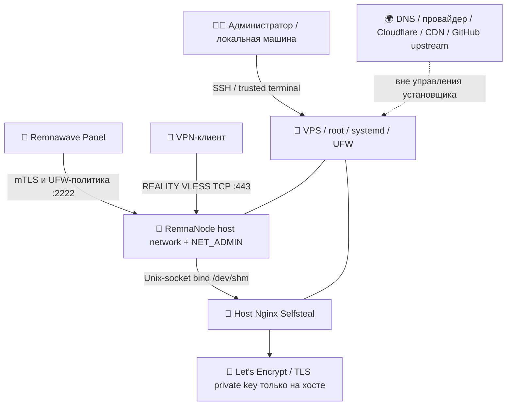

<div align="center">

# 🔐 VKARMANI · SECURITY POLICY

**Безопасность выделенной Remnawave-ноды: модель угроз, привилегии, секреты, защита сети и восстановление**

🛡️ **Проект:** Node_Install `2.5.6` · 📅 **Актуализировано:** 09.10.2026 · 🚨 **Vulnerability reporting:** [Security](https://github.com/SUXARIK-GITHUB/Node_Install/security)

[🚨 Сообщить об уязвимости](#report) · [🧭 Карта рисков](#threat) · [🔒 Секреты](#secrets) · [🌐 UFW](#firewall) · [📦 Docker](#container) · [🌍 REALITY](#selfsteal) · [🔄 Supply chain](#supply) · [🧯 Инциденты](#incident)

</div>

---

> [!IMPORTANT]
> Установщик запускается с **root** на отдельной VPS и меняет **SSH, UFW, Docker, Nginx, systemd, GRUB, sysctl и сертификаты**. Security-модель строится не на лозунге «невидимая нода», а на границах доверия, контрольных суммах, проверке перед записью, доступности консоли хостера, ограничении секретов и предсказуемом откате. **Реальная работа Panel → Node и клиента проверяется отдельно.**

## 🧭 Быстрые карты безопасности

| 🚨 Если случилась проблема | 🛡️ Что защищаем | 🔎 Что проверяем | 🧯 Как восстанавливаем |
|:--|:--|:--|:--|
| [📩 Сообщить об уязвимости](#report) | [🔐 Секреты и ключи](#secrets) | [🌐 Открытые порты](#firewall) | [🚑 Инциденты](#incident) |
| [⚠️ Модель угроз](#threat) | [🐧 SSH/OS](#ssh) | [🐳 Контейнер](#container) | [💾 Backup](#backup) |
| [🧩 Границы доверия](#trust) | [🌍 REALITY/Selfsteal](#selfsteal) | [📦 Поставки и SHA](#supply) | [⏱️ Reboot](#reboot) |
| [🧱 IPv4-only](#ipv4) | [🔄 RKN Guard](#rkn-security) | [🧪 Диагностика](#logging) | [🚫 Ограничения](#limits) |

<a id="report"></a>
## 🚨 Сообщение об уязвимости (GitHub Security)

**Не публикуйте в открытом Issue/PR/Discussion** секреты, exploit-цепочки с доступом к реальному серверу, скриншоты с ключами, клиентские подписки или IP-инвентарь пользователей.

1. Откройте **[Security проекта](https://github.com/SUXARIK-GITHUB/Node_Install/security)**. Если доступна кнопка **Report a vulnerability / Private vulnerability reporting**, используйте её.
2. Если приватная отправка недоступна, запросите у владельца репозитория **закрытый контактный канал**, сообщив в открытой части только о необходимости безопасной связи; **не** вкладывайте детали уязвимости.
3. Для воспроизведения используйте **отдельную тестовую VPS** и обезличенные логи. Укажите версию, ОС, архитектуру, affected component, безопасные шаги воспроизведения, ожидаемое/фактическое поведение и возможное воздействие.
4. Не запускайте активную эксплуатацию неизвестных уязвимостей на production VPS и не исправляйте их отключением TLS/SSH/UFW «на время проверки».

**Никакой email для security-report не выдумывается:** официального адреса, подтверждённого владельцем, в проекте нет. GitHub Security tab — точка входа, если частные обращения действительно включены.

<a id="versions"></a>
### 📦 Поддерживаемые версии и статус проверки

| Выпуск | Статус | Рекомендация |
|:--|:--|:--|
| `2.5.6` | Исправление NTP race, защищённая финальная фаза и честная диагностика; новая VPS ещё отдельно проверяется | Canary на отдельной VPS; реальные клиент/панель и reboot |
| `2.5.5` | Исходная race финальной NTP-проверки воспроизведена; рабочая нода может быть исправна после завершения recovery | Не переустанавливать работающую ноду ради версии |
| `2.5.2–2.5.4` | Исторические совместимые поколения; исправления могут быть не перенесены на сервер | Плановая контролируемая миграция, не `install.sh` поверх живого узла |
| `≤2.5.1` | Архивные версии без гарантии сопровождения security-исправлений | Не начинать новое развёртывание без аудита |

Нет обещанного срока исправления инцидентов и нет SLA. Проверяйте [GitHub Releases/коммиты](https://github.com/SUXARIK-GITHUB/Node_Install) и утверждённые release notes до любого обновления.

<a id="threat"></a>
## ⚠️ Карта угроз и контрольных мер

| Вектор | Существующий контроль | Остаточный риск / действие оператора |
|:--|:--|:--|
| SSH brute force | Password-only policy, Fail2ban, сохранение существующих SSH-портов | **Password-only увеличивает риск**, обязателен сильный пароль, защита панели хостера, fail2ban и контролируемый доступ |
| Panel API извне | UFW ACL только от IPv4 backend панели + mTLS | Смена IP панели требует отдельного изменения **UFW ACL**, а не только `--rkn-sync-panel` |
| Сканирование VPN/IP | REALITY+Selfsteal, узкий RKN Guard | Невозможно гарантировать отсутствие DPI fingerprint и блокировки IPv4/ASN |
| Взлом контейнера | `NET_RAW` dropped, `no-new-privileges`, read-only socket mount, pinned image digest | `network_mode: host` + **NET_ADMIN** позволяют влиять на сеть хоста; нет полной изоляции |
| Подмена установщика | HTTPS, неизменяемый Git commit URL, SHA256, Bash syntax/version check | Хеш из того же недоверенного источника не образует независимую trust chain |
| Подмена RKN CIDR | Валидация CIDR/лимитов, last-known-good, atomic `ipset swap` | Данные в GitHub внешние/недоверенные; ошибочный список может блокировать легитимных клиентов/ACME |
| Похищение REALITY/Node secret | Root-only файлы, `umask 077`, запрет вывода в логи | Компрометация root, backup или админского ПК компрометирует приватные ключи |
| Падение Certbot/Nginx | `nginx -t`, deploy-hook, TLS leaf/h2 checks, ACME на 80 | Блокировка HTTP-01 UFW/RKN/провайдером приведёт к просрочке сертификата |
| Некорректный inbound в Panel | Шаблоны, `rw-core run -test` для XHTTP подготовки, отдельный клиентский test | RemnaNode перезапускает Core; аварийное применение может оборвать клиентов |
| Неподдерживаемый Xray Core | Official image digest, ручная проверка upstream, read-only `--xray-versions` | Самый свежий upstream/pre-release **может** быть несовместим с RemnaNode |
| Потеря доступа при reboot | Preflight, частичный SSH/UFW rollback, provider console, VPS snapshot | Полного автоматического восстановления всех ресурсов **нет** |

**Приоритет восстановления:** безопасность секретов и пользователей → доступ к VPS/backup → целостность сети/БД/панели → рабочий TLS/Node → оптимизации/визуальная маскировка. Не выполняйте destructive migration или `prune` как диагностический шаг.

<a id="trust"></a>
## 🧩 Модель доверия (trust boundaries)



**За пределами возможностей установщика:** аккаунт Cloudflare, провайдерский firewall/security group, гипервизор, сам Remnawave Backend и его БД, хранение пользовательских подписок, состояние клиентских устройств, исходящие маршруты операторов связи. Локальная проверка слушателя TCP/2222 **не подтверждает** успешную авторизацию панели; локальный `nginx -t` **не подтверждает** работу публичного HTTPS через Xray.

---

<a id="rkn-security"></a>
## 🛡️ RKN Guard и динамический IPv4 панели

В проект встроена **управляемая реализация фильтрации**, а не выполняемый бинарник/установщик [Flecksis/rkn-guard](https://github.com/Flecksis/rkn-guard). Ежедневно обновляются **только сетевые данные** из связанного GitHub source; upstream-код не обновляется автоматически с правами root.

- IPv4-сети проверяются на CIDR, лимит, запрет неожиданно широких диапазонов; применяется `ipset swap`. Ошибка загрузки сохраняет last-known-good. UFW-файлы изменяются через маркированный блок с backup/проверкой/откатом.
- Блокируются только **новые TCP/80 и TCP/443** из списка. Исключение IPv4 backend панели читается из `config.json` при каждом prepare/update, **без хардкода**.
- `--rkn-sync-panel` меняет **только исключения RKN**. Основной UFW ACL TCP/2222 и provider firewall требуют отдельной безопасной синхронизации, иначе панель может потерять доступ при смене egress-IP.
- Проверяйте обновление ACME HTTP-01 на TCP/80 после обновления CIDR. RKN Guard не предотвращает блокировку вашего VPS IPv4/ASN и не доказывает «незаметность».
- Перед каждой новой сборкой Node_Install обязательно проверяйте актуальность [Flecksis/rkn-guard](https://github.com/Flecksis/rkn-guard) и [источника подсетей](https://github.com/shadow-netlab/traffic-guard-lists) по [`docs/RKN_GUARD_2.5.3.md`](docs/RKN_GUARD_2.5.3.md).

---

<a id="trust-details"></a>
## 🧭 Доверие, системные зоны и запреты установки


```text
Устройство администратора
          │ SSH / пароль / terminal
          ▼
Выделенная VPS ноды
          ├── host OS / root / systemd / UFW / Fail2ban
          ├── host Nginx + private key Let's Encrypt
          ├── Docker daemon
          └── RemnaNode container (host networking)
                  │
                  ├── management API :2222  ◄── Remnawave backend / mTLS
                  └── Xray public :443      ◄── REALITY-клиенты

Внешние зоны, не управляемые installer:
provider hypervisor / security group / upstream ACL / anti-DDoS
DNS / Cloudflare account
Remnawave panel и её БД
рабочая станция / terminal logging администратора
клиентские приложения / subscription storage
```

Успешная локальная проверка доказывает только тот слой, который реально проверен. Listener на `2222` не доказывает panel mTLS; Xray на `443` не доказывает Host/Squad/subscription; local Selfsteal PASS не доказывает user VPN.

Установщик нельзя запускать:

- на VPS панели/БД;
- на сервере с чужими production-контейнерами/службами;
- на машине с нестандартным firewall/network/boot stack без отдельного аудита;
- там, где потеря SSH без provider console делает recovery невозможным.

---

<a id="ssh"></a>
## 🔑 SSH — парольная политика и её риски


По новому прямому требованию проекта **вход по SSH-ключам отключается**. Действует только `password`, не `any`: `PubkeyAuthentication no`, `PasswordAuthentication yes`, `AuthenticationMethods password`; keyboard-interactive, hostbased и GSSAPI выключены. Пустые пароли запрещены. Порты сохраняются, постоянного source-IP allowlist нет.

До изменения проверяются существующая локальная парольная запись администратора, блокировка/сроки и login shell. Сырые shadow/hash/password не выводятся. Установщик не задаёт четвёртый вопрос: при отсутствии пригодной записи — STOP и подготовка пароля вне installer через консоль хостера. Это не доказывает, что оператор знает пароль, что PAM/хостер разрешат любой вход, или что сеть доступна.

Управляемый блок ставится первым, но одного first-value-wins недостаточно при Match: условные/нестандартные Include/Allow/Deny-политики отвергаются без удаления. Candidate `sshd_config` проверяется `sshd -t/-T` перед атомарной заменой; effective policy проверяется повторно. `authorized_keys` сохраняются на диске, но не принимаются новым sshd для входа.

Installer не:

- создаёт OS-пользователей;
- задаёт/меняет пароли;
- разблокирует заблокированный root;
- удаляет существующие `authorized_keys`;
- требует SSH-key;
- добавляет бессрочный SSH allowlist для панели/администратора.

При уже действующем root-пароле root password login может оставаться доступным. Это сознательно рискованнее key-only SSH. Используйте длинный уникальный случайный пароль и password manager. Fail2ban снижает bruteforce-нагрузку, но не защищает от повторно используемого пароля, malware на рабочей станции, утечки terminal log или root-compromise.

Перед изменением SSH/UFW создаётся phase-specific backup и короткий rollback guard. Этот guard страхует **конкретную фазу**, но не доказывает внешний SSH-вход и не откатывает всю ОС.

Безопасный порядок:

1. не закрывать старую SSH-сессию;
2. после изменений открыть новую парольную сессию;
3. проверить root/sudo;
4. держать console/recovery хостера доступной до post-reboot приёмки.

Не выключайте UFW/Fail2ban и не добавляйте широкий постоянный `ignoreip` ради unban. Через provider console или сохранённую trusted-сессию снимайте только точный подтверждённый бан.

---

<a id="secrets"></a>
## 🔐 Секреты, права файлов и утечки


### Критические секреты

| Данные | Почему чувствительны |
|---|---|
| RemnaNode `SECRET_KEY` | используется в control relationship ноды; это не panel admin API token |
| `/etc/vkarmani-node/remnanode.env` | содержит `SECRET_KEY` |
| REALITY `PrivateKey` | приватный X25519 key сервера |
| `/etc/vkarmani-node/reality.json` | содержит REALITY PrivateKey |
| `/etc/vkarmani-node/profile.json` | содержит REALITY PrivateKey |
| `/root/reality-keys.txt` | явный export PrivateKey/PublicKey/ShortID; `root:0600` |
| `/etc/letsencrypt/**/privkey.pem` | приватный TLS key |
| `/etc/letsencrypt/` account/private state | чувствительное ACME-состояние |
| configuration backups | агрегируют системные и application-конфиги |
| live config/environment dumps | могут содержать секреты/идентификаторы/ключи |

`PublicKey`, `ShortID`, домен и клиентские параметры не эквивалентны PrivateKey, но полные production topology/config dumps тоже не нужно публиковать без необходимости.

### Что нельзя выкладывать публично

Не отправляйте без redaction:

```text
.env / *.env
/etc/vkarmani-node/remnanode.env
/etc/vkarmani-node/reality.json
/etc/vkarmani-node/profile.json
/root/reality-keys.txt
/etc/letsencrypt/
полные configuration backups
полный `docker inspect`
полный `docker compose config`
`docker exec ... env`
полный live Xray/Remnawave config dump
production VLESS subscription links
```

VLESS-ссылка сама является access material. Для внешнего тестера создавайте отдельного ограниченного test-user и отзывайте его после проверки.

### Как installer обращается с секретами

Используются `set +x`, restrictive `umask`, скрытый ввод из TTY и root-only файлы. `SECRET_KEY` не должен передаваться обычным argv внешней команды и не печатается в штатный вывод. Crypto/maintenance errors не должны dump-ить payload.

В `2.3.0` `/root/reality-keys.txt` создаётся только после успешной local acceptance. Файл пишется атомарно и должен оставаться regular root-owned `0600`. Existing symlink, non-regular type, чужой owner или слишком широкие права вызывают STOP вместо перезаписи.

Финальный блок REALITY keys выводится напрямую в controlling TTY, поэтому PrivateKey не дублируется в общий install log. Это **не** защищает от:

- MobaXterm/terminal session logging;
- scrollback;
- screenshot/screen recording;
- root access;
- Docker socket access;
- privileged memory inspection.

Base64 — кодирование, а не шифрование. Configuration backup tar не становится encrypted только потому, что хранится в закрытой директории. Нужные backups переносите в защищённое off-host хранилище и отдельно проверяйте restore.

---

<a id="firewall"></a>
## 🌐 Сетевые ACL, порты и multi-IP


Ожидаемые входящие порты:

| Порт | Роль | Ожидаемый источник |
|---|---|---|
| существующие SSH TCP-порты | администрирование | IPv4 Internet с временными Fail2ban-банами |
| `80/tcp` | ACME HTTP-01 + redirect | IPv4 Internet к выбранному Node-domain IPv4 |
| `443/tcp` | Xray VLESS RAW REALITY / Selfsteal | IPv4 Internet к выбранному Node-domain IPv4 |
| `2222/tcp` | RemnaNode management API | **только** заданный backend egress IPv4 панели |

`2222/tcp` нельзя открывать всему Интернету как troubleshooting shortcut. Source-IP allowlist уменьшает поверхность, но не заменяет mTLS RemnaNode.

UFW использует deny incoming/routed и allow outgoing. Installer проверяет ожидаемую UFW/INPUT-топологию, но не утверждает, что полностью понимает любой внешний/низкоуровневый фильтр:

- provider security group / ACL;
- upstream anti-DDoS;
- custom nftables raw/mangle hooks;
- eBPF;
- hypervisor firewall;
- маршрут из другой страны/ASN.

Не накладывайте второй firewall manager поверх этой схемы без отдельного design review.

### Multi-IP ноды

Домен ноды должен указывать на публичный IPv4, реально назначенный VPS. На multi-IP сервере management `Address` в Remnawave может использовать другой публичный IPv4 **той же VPS**, а клиентский Host/SNI продолжит использовать домен ноды.

UFW допускает backend панели к `2222` на локальных публичных IPv4 ноды именно для такого сценария. Это не повод убирать source restriction панели.

---

<a id="ipv4"></a>
## 🌍 IPv4-only, DNS и Cloudflare


Проект сознательно IPv4-only:

- у домена ноды ровно одна A-запись на прямой local public IPv4 VPS;
- AAAA у домена ноды отсутствует;
- Cloudflare record ноды — DNS-only, не proxied/CDN;
- IPv6 отключается runtime и через GRUB `ipv6.disable=1`;
- полная socket-level проверка выполняется после reboot.

NAT-only, IPv6-only, LXC/OpenVZ и неподдерживаемый boot layout не адаптируются «на глаз». Installer должен STOP-нуться, а не угадывать routes/IP или переписывать provider network config.

Локальный `vkarmani-node-tls-check` не проходит реальный Internet path panel→node. Его PASS не исключает upstream firewall, PMTU, anti-DDoS или route problem.

---

<a id="container"></a>
## 🐳 Контейнер, NET_ADMIN и границы Docker


RemnaNode работает в `network_mode: host`. Это часть выбранной архитектуры и означает общий network namespace с хостом. Это **не** полноценная network isolation.

Начиная с `2.4.0` по умолчанию:

- `NET_ADMIN` **выдаётся** контейнеру RemnaNode. Это сознательное изменение проекта для функций, которым нужен доступ к сетевому состоянию хоста, включая «Обозреватель сессий»;
- `NET_RAW` по-прежнему сброшен;
- включён `no-new-privileges`;
- в контейнер read-only монтируется только dedicated Selfsteal socket directory;
- private keys Let's Encrypt в Xray не монтируются;
- после pull image фиксируется точным digest.

При `network_mode: host` capability `NET_ADMIN` существенно расширяет влияние процессов контейнера на сеть VPS: код внутри контейнера потенциально может менять интерфейсы, маршрутизацию, qdisc и firewall/network namespace state, доступный этому namespace. Поэтому compromise RemnaNode/Xray или дефект upstream имеет больший blast radius, чем в 2.3.0 default без этой capability. Это принятый trade-off ради требуемой функции, а не дополнительная изоляция.

`--allow-net-admin` сохранён только для совместимости старых команд и в `2.4.0` не является opt-in: новая установка и resume `2.4.0` сохраняют `allow_net_admin=true`, Compose содержит `cap_add: NET_ADMIN`, а checker требует соответствия state фактической capability. Существующие завершённые 2.3.0-ноды обычным повторным запуском installer автоматически не мигрируются.

Доступ к Docker socket остаётся root-equivalent. Container hardening не защищает от root/Docker-daemon compromise.

---

<a id="selfsteal"></a>
## 🎭 REALITY, Vision/XHTTP и Selfsteal


Архитектура проекта — **VLESS + RAW + REALITY + Vision** или **VLESS + XHTTP + REALITY**; активным бывает **один** inbound TCP/443. В `serverNames` используется собственный домен ноды. Обычный HTTPS/не-REALITY путь отправляется через:

```text
target=/dev/shm/nginx.sock
xver=1
```

Внутри контейнера `/dev/shm/nginx.sock` — read-only bind-представление host-каталога с:

```text
/run/vkarmani-selfsteal/nginx.sock
```

Nginx на хосте обслуживает TLS/cover на Unix socket. Публичный TCP/443 принадлежит Xray. Не заставляйте host Nginx слушать public 443 в этой архитектуре.

Не используйте чужие домены/IP как REALITY target/SNI в рамках этого проекта. Владение доменом, правила провайдера и допустимость сервиса по договору остаются обязанностью оператора. Рабочий сертификат/DNS подтверждают только технический контроль в ограниченном смысле.

Cover-site не является гарантией «невидимости». Он не скрывает IP сервера, связь доменов, TLS/client fingerprints, публичный SSH и все характеристики трафика. Не ослабляйте TLS/security checks на основании неподтверждённых «anti-DPI/undetectable» советов.

### `minClientVer`

Выпуск **2.3.0** генерирует и локально проверяет именно выбранную политику совместимости:

```json
"minClientVer": "0.0.0"
```

Она снимает нижний version-gate и согласована между profile, validator, guide и export. Это не обещание безопасности/работоспособности произвольного старого клиента и не реализация отсутствующих в нём функций. Генератор 2.1.2 использовал `1.0.0`; его оригинальная документация сохранена в `docs/history`.

**Никаких удалённых профилей installer не переписывает.** Уже установленные helpers не следует заменять без явной контролируемой операции. Не заменяйте отдельный helper на рабочей ноде и не перегенерируйте `profile.json` ради прохождения нового validator: разные поколения template требуют отдельной согласованной миграции.

`profile-check` читает только предоставленный regular JSON-файл размером до 2 MiB, отвергает финальный symlink, FIFO, duplicate JSON keys и NaN/Infinity. При отказе значения секретов/сырой JSON не выводятся. Это защита границ чтения, не sandbox от конкурирующего root.

Структурный PASS подтверждает перечисленные DNS/IPv4/routing-ссылки и Selfsteal-контракт, **не полноту правил блокировки и не фактическую недоступность private/metadata/IP-панели через TCP/UDP**. Для этого нужны отдельные контролируемые тесты конечного выхода. Общий Vision и служебный API RemnaNode учитываются, но не создаются validator.

---

<a id="tls"></a>
## 📜 Nginx, TLS, HTTP/2, ACME и Certbot


Nginx работает на хосте. Public TCP/80 нужен HTTP-01 и redirect. Selfsteal TLS обслуживается через local Unix socket. Сертификаты/private keys остаются на хосте.

Перед ручной правкой Nginx:

1. backup точных изменяемых файлов;
2. `sudo nginx -t`;
3. только после успешного syntax test — reload;
4. `sudo vkarmani-selfsteal-check`;
5. при ожидаемом live Xray — `sudo vkarmani-node-check --require-xray`.

Проверка ACME без доказательства deploy hook (мутация: staging CA/временные challenge):

```bash
sudo certbot renew --dry-run --non-interactive
```

В 2.3.0 первоначальный dry-run выполняется с `--run-deploy-hooks`. Helper проверяет **новый** успешный receipt и совпадение предъявленного target сертификата с активным сертификатом на диске. Certbot при таком dry-run использует для deploy hook активный сертификат, не staging-сертификат. Наличие старого PASS не считается успешным текущим прогоном.

Deploy hook теперь: локальный private config → `nginx -t` → `systemctl reload nginx` → `vkarmani-selfsteal-check --target-only` с общим бюджетом 75 секунд. Каждая команда ограничена максимумом 20 секунд, повторяется только проверка target, а не reload. SIGINT/TERM/HUP не проглатываются retry-циклом. Другой lineage пропускается; отсутствие/несоответствие контекста Certbot — ошибка. Lock и root:0600 receipt атомарны. SIGKILL/power loss могут оставить RUNNING; это не PASS. Сертификаты Certbot и firewall не откатываются произвольно.

Полная проверка страницы по-прежнему обязательна при приёмке новой установки/обновления страницы, но не определяет готовность TLS после reload. Изменение CSS не должно выдаваться за неактивный сертификат. Внешний VPN отдельно не доказан.

Не используйте `--force-renewal` как повседневную диагностику. Если сохраняется HTTP-01, TCP/80 должен оставаться доступен для renewal.

---

<a id="packages"></a>
## 📦 APT/dpkg, OS/time providers


Нельзя «чинить» APT locks удалением lock-файлов или убийством штатных `apt`, `dpkg`, `unattended-upgrade`. В `2.1.1+` installer ждёт реальных владельцев package-manager lock в bounded deadline, затем делает `dpkg --audit` и продолжает только из согласованного состояния.

Security updates не отключаются только ради более быстрой установки.

Исправленный ранее конфликт time-daemon решён сохранением поддерживаемого существующего `systemd-timesyncd` или Chrony. Общий принцип `--no-remove` сохраняется: installer не должен молча удалять посторонние пакеты, чтобы удовлетворить новый APT plan.

Если пакетная операция остановилась или состояние dpkg подозрительно:

```bash
sudo dpkg --audit
```

Сначала восстановите реальное package state. Незавершённую установку продолжайте **той же generation/version**, если нет документированного узкого migration path. Не редактируйте version/state markers вручную ради cross-version resume.

---

<a id="supply"></a>
## 📥 Supply chain, SHA256 и доверие к релизам


### Получение `install.sh`

Не используйте live `curl | bash`. Главная команда из актуального README:

1. скачивает полный файл;
2. сверяет известный SHA256 release;
3. делает `bash -n`;
4. проверяет `--version`;
5. запускает только после всех проверок.

SHA256 проверенного `install.sh` версии `2.5.6` (новый код NTP/finalization):

```text
da745235274cee2ea89d5986e7107b5848d0ef2a8fa2767d3fba2a253b40041b
```

Если `install.sh` изменён, README и release manifest должны обновляться согласованно после review. Никогда не вычисляйте новый хеш из недоверенного изменившегося файла и не называйте его после этого «проверенным».

### OS packages и Docker

Пакеты ставятся из подписанных repositories. Fingerprint Docker signing key проверяется. Не обходите fingerprint failure без сверки нового ключа по авторитетному источнику vendor.

RemnaNode image ограничивается ожидаемым official namespace и после pull закрепляется digest. Namespace/digest pinning улучшает repeatability, но не является полной cryptographic attestation содержимого image или доказательством совместимости с конкретной версией панели.

### CI

CI предназначен для test/validation, а не production deployment. Production secrets/deploy credentials не должны появляться там только ради удобства тестов. Не используйте `pull_request_target`-подходы, исполняющие недоверенный contributor code с privileged secrets.

---

<a id="backup"></a>
## 💾 Backup, rollback и проверка восстановления


Configuration backups установщика полезны, но **не равны provider snapshot**. Snapshot/recovery остаётся whole-system boundary.

`vkarmani-node-maintain backup` создаёт закрытый configuration archive + checksums. Относитесь к archive как к secret. Проверяйте его до того, как рассчитывать на restore, и храните off-host copy, если backup входит в recovery plan.

Image update/rollback не возвращает:

- OS packages;
- GRUB/sysctl;
- уже потерянный writable layer пересозданного контейнера;
- Remnawave DB/objects;
- user subscriptions/sessions;
- provider network/firewall state.

При `IMAGE_APPLY=UNKNOWN` сначала проверяется реальное состояние Docker. Не удаляйте pending state и не запускайте параллельные update/rollback.

SSH/UFW rollback helper возвращает только принадлежащий ему phase backup. Это не rollback всей установки.

---

<a id="reboot"></a>
## 🔄 Перезагрузка и сохранение SSH-доступа


В `2.3.0` один post-install reboot включён по умолчанию. Он ставится через transient systemd unit только после успешной local preboot acceptance и export ключей.

Для ручного окна проверки:

```bash
sudo bash install.sh --no-reboot
```

Это особенно важно, если provider console/recovery ненадёжна.

Если transient reboot unit не удалось поставить, installer сообщает `AUTO_REBOOT=FAILED`; успешный `INSTALL_COMPLETE` при этом не удаляется. Reboot выполняйте вручную только после проверки состояния.

Weekly reboot остаётся opt-in через `--weekly-reboot` и по умолчанию выключен.

---

<a id="logging"></a>
## 🧪 Диагностика и обезличивание логов


Предпочитайте узкий read-only вывод:

```bash
sudo vkarmani-node-check
sudo vkarmani-node-check --require-xray
sudo systemctl --failed --no-pager
sudo ufw status verbose
sudo ss -4 -lntp
sudo docker ps --format 'table {{.Names}}\t{{.Status}}\t{{.Networks}}\t{{.Ports}}'
sudo fail2ban-client status sshd
```

Перед отправкой диагностики удалите/замаскируйте:

- домашний/admin public IP, если он не нужен для анализа;
- имена пользователей, не относящиеся к проблеме;
- `SECRET_KEY`;
- REALITY PrivateKey;
- TLS private keys;
- user UUID/VLESS subscription link;
- cookies/tokens/authorization headers;
- полный `.env`/container environment;
- backup archives.

PublicKey/ShortID/domain иногда нужны для protocol troubleshooting, но всё равно публикуйте только минимально необходимое.

При проблеме panel→node packet capture **на самой ноде** позволяет отличить «пакет вообще не дошёл до интерфейса» от «его отбросили UFW/service», не требуя изменений на панели. PCAP/tcpdump содержит IP metadata — храните его приватно либо редактируйте перед публикацией.

---

<a id="incident"></a>
## 🚑 Реагирование на инциденты


### Утечка `SECRET_KEY` / REALITY PrivateKey

1. Сохранить provider console access и минимально необходимую закрытую диагностику.
2. Прекратить дальнейшую публикацию logs/screenshots/config dumps.
3. Определить, что именно было раскрыто: `SECRET_KEY`, REALITY key, TLS key, SSH password, backup, root/panel credential.
4. Согласованно ротировать material в панели/Node/client configuration. Простое удаление/перегенерация только на VPS может оставить панель со старыми данными.
5. Обновить subscriptions/clients там, где credentials изменились.
6. Удалить публичные копии, но считать уже опубликованный secret скомпрометированным даже после удаления поста.

### Подозрение на root compromise

Не доверяйте локальным integrity checks, выполненным из потенциально скомпрометированной root-среды. Безопаснее поднять чистую VPS из доверенного image, ротировать соответствующие credentials и переносить только просмотренные данные/config.

### Потерян SSH

Используйте provider console/recovery. Не отвечайте на проблему открытием всех портов/выключением firewall через сомнительный путь.

### Панель не достаёт `2222`

Не открывайте `2222` всему миру. Сначала:

```bash
sudo ss -4 -lntp | grep ':2222'
sudo ufw status numbered
sudo vkarmani-node-tls-check
```

Затем на ноде можно захватить только управление `2222`, параллельно инициировав попытку панели:

```bash
sudo timeout 120 tcpdump -ni <interface> -nn -tttt -vv 'tcp port 2222'
```

Если во время заведомой попытки панели SYN вообще не приходит на interface, проблема находится до UFW/RemnaNode на этом path: egress/route панели, provider ACL/anti-DDoS и т.п. Если SYN приходит — дальше проверяются UFW/TCP/mTLS/service layers. Не называйте это «баном провайдера», пока evidence не показывает, где именно фильтрация.

---

<a id="disclosure-details"></a>
## 📩 Правила disclosure и состав отчёта


Не придумывайте несуществующий security email. Используйте приватный contact method владельца репозитория/platform, если он доступен. Если есть только public issue tracker, публикуйте только просьбу дать private channel — без exploit details, secrets и production identifiers.

Хороший redacted report содержит:

- installer version;
- OS/architecture;
- clean/new node или existing install;
- точный stage/error code;
- минимальные отредактированные log lines;
- reproducible steps на disposable test-node;
- expected vs actual;
- отдельно — что уже проверено на provider firewall/panel/client уровне.

---

<a id="limits"></a>
## 🚫 Что модель безопасности не обещает


Проект не обещает:

- отсутствие provider blocking/route failures;
- «невидимый/неопределяемый» трафик;
- защиту от скомпрометированного root/Docker daemon;
- безопасность слабого/повторно используемого SSH-пароля;
- работоспособность панели/клиента только потому, что local tests PASS;
- совместимость любого древнего core после `minClientVer=0.0.0`;
- автоматическое понимание любого custom nftables/eBPF/provider firewall;
- full OS rollback из configuration backup;
- безопасный mass rollout без canary и provider-specific acceptance.

Не обходите STOP/guard только потому, что другой сервер установился. STOP может защищать другое состояние: boot layout, firewall, package manager, provider image или уже существующий production config.

---

<a id="references"></a>
## 📚 Связанные документы


- [README.md](README.md) — установка, Remnawave, архитектура и operator commands.
- [docs/OPERATIONS.md](docs/OPERATIONS.md) — эксплуатация, диагностика и recovery.
- [docs/TEST_REPORT.md](docs/TEST_REPORT.md) — test coverage и явные gaps.
- [docs/REALITY_KEYS_AUTOREBOOT_2.1.2.md](docs/REALITY_KEYS_AUTOREBOOT_2.1.2.md) — secure key export и auto-reboot.
- [docs/APT_LOCK_COORDINATION_2.1.1.md](docs/APT_LOCK_COORDINATION_2.1.1.md) — package-manager lock policy.
- [docs/HOSTING_AND_INCIDENTS.md](docs/HOSTING_AND_INCIDENTS.md) — provider/network incidents.
- [docs/COVER_SITE.md](docs/COVER_SITE.md) — cover-site update/rollback boundaries.
- [docs/UFW_PREFLIGHT_FIX.md](docs/UFW_PREFLIGHT_FIX.md) — strict saved-UFW rules handling.
- [docs/TIME_SYNC_FIX.md](docs/TIME_SYNC_FIX.md) — сохранение поддерживаемого time provider.
- [docs/UBUNTU_26_04.md](docs/UBUNTU_26_04.md) — статус 26.04 и требования canary.
- [docs/FAILURE_AUDIT.md](docs/FAILURE_AUDIT.md) — failure modes и остаточные риски.
- [docs/NET_ADMIN_2.4.0.md](docs/NET_ADMIN_2.4.0.md) — default `NET_ADMIN`, существующие ноды и rollback-границы.

---

<a id="ntp-finalization"></a>
## ⏱️ NTP и финальная транзакция — 2.5.6

Кратковременное отсутствие `ServerAddress` после запуска timesyncd нельзя интерпретировать как постоянную поломку; но старый `NTPSynchronized=yes` и оставшийся маркер тоже не доказательство нового NTP-ответа. В 2.5.6 действуют общий монотонный deadline, ограниченные команды, два последовательных успешных наблюдения и проверка, что `InvocationID` не сменился. IPv6-источник, `Ignored=yes`, нулевой PacketCount, неподходящие Leap/Mode/Stratum и неверный marker **не принимаются за успех**. Chrony сохраняет проверку `waitsync` с коррекцией менее 0,1 секунды.

Никакие источники NTP не подменяются. `unattended-upgrades` и `needrestart` не отключаются; чужие package locks/процессы не удаляются. Серия повторных запусков службы в исходном журнале видна, однако их инициатор этим журналом **не доказан**. Исправляется реакция приёмки на восстановимую гонку, а не выдуманная причина рестартов.

Перед финальной приёмкой создаётся закрытая `/var/lib/vkarmani-node/finalization/`: snapshot конфигураций, helpers и исходного `before.rules`, копия уже одобренного установщика, SHA256 и фазовый checkpoint. **Snapshot содержит секреты** и не должен попадать в Git, чаты или публичные backup. Каталоги имеют 0700, файлы 0600; запрещены небезопасные ссылки/владельцы/права. Сначала также проверяется исходная резервная копия.

`--finish-install` и автоматическое направление повторного запуска в финальную фазу разрешены только для этой 2.5.6 и соответствующего checkpoint. Проверяются локальный IPv4, digest работающего контейнера, неизменность конфигураций и helpers, контрольные суммы snapshot, отсутствие чужих незавершённых транзакций. При расхождении — остановка, не перезапись «правильными» данными.

Финализатор не устанавливает пакеты, не крутит Docker/Nginx, не меняет SSH, не ротирует ключи и не планирует reboot. Он применяет только предусмотренное завершение RKN через сохранённую проверенную реализацию. Ошибка RKN допускает `DEGRADED_ROLLED_BACK` **лишь после проверенного возврата исходного UFW, отсутствия RKN drop-in и успешной повторной приёмки**. Неподтверждённый rollback останавливает завершение; нужен разбор с консолью хостера.

`INSTALL_COMPLETE` публикуется атомарно без замены существующего marker, только после проверок. Прерывание между публикацией и очисткой старого failure-marker обрабатывается повторным finish по собственному проверенному checkpoint. Повторное завершение идемпотентно. Это ограниченный replay финальной фазы, **не** универсальный rollback ОС/пакетов, восстановление snapshot VPS или мигратор 2.5.5.

Частичная диагностическая информация (`verified=false`, включая `/proc/PID/fd`) обозначается `REVIEW_REQUIRED`, а не маскируется успешным возвратом процесса. `--diagnose-resources --strict` возвращает 2 при таких результатах. Системные события вроде пары ретрансляций или одного timeout сами по себе не доказывают блокировку РКН и не запускают автоматический тюнинг.

<a id="history"></a>
## 🕰️ Security changelog: полный технический контекст

Все предыдущие release-specific security notes сохранены **без сокращения** в раскрываемых разделах ниже и в [полном архивном SECURITY.md до обновления](docs/history/SECURITY_2.5.5_before_ui_refresh.md). Это важно для расследования отказов старых установок, ABI/iptables regressions и сверки миграций.


<details>
<summary>📂 <strong>2.5.5 — Xray supply chain и безопасные RAW/XHTTP примеры</strong></summary>


- Обнаружение версии Xray является **только чтением**. Официальные HTTPS release metadata недоверенны для автоматического исполнения: новые Xray pre-release и различие версий в образе RemnaNode **никогда не приводят** к скачиванию/запуску бинарника от root. При отказе GitHub выводится `NOT_VERIFIED`.
- В RemnaNode upstream присутствует `geodata.core` с URL+SHA256 и staging/rollback встроенного Core, но использование этого механизма требует подготовленного вручную, проверенного на staging артефакта и изменения именно Panel Config Profile. Свежий `latest` не является гарантией безопасности и совместимости.
- Публичные JSON-примеры из `examples/` и README содержат **только placeholder** для `privateKey` и ShortID. Используйте реальные ключи из защищённых файлов конкретной VPS (`root:0600`); нельзя публиковать их в Git, багрепортах и телеграммах. При раскрытии ключа требуется безопасная ротация, включая обновление конфигурации панели/клиентов.
- Меняется только выбранный inbound панели; максимум один публичный VLESS слушатель TCP/443. XHTTP не использует Vision flow; Nginx Selfsteal на read-only Unix-socket через `xver:1` и `PROXY protocol v1` остаётся прежним.
- Все прежние ACL для панели, UFW, RKN Guard и SSH действуют независимо от смены транспорта. Обе конфигурации требуют реальной проверки после применения. DPI/IP-блокировки этим кодом не устраняются автоматически.

</details>


<details>
<summary>📂 <strong>2.5.3 — RKN data firewall: supply chain, access and rollback</strong></summary>


- Файл `integrations/rkn_guard.py` встроен в self-contained `install.sh`; загрузка и исполнение upstream `Flecksis/rkn-guard` бинарника, install.sh, Go-кода **не выполняются**.
- HTTPS-список `shadow-netlab/traffic-guard-lists` обновляется ежедневно как **недоверенные входные данные**, проверяется CIDR и размер списка, затем `ipset swap`; сетевая ошибка сохраняет последний корректный список. Не заменяйте проверенный URL сторонним без нового code review.
- Только IPv4 TCP/80,443; UFW SSH/2222 остаётся основной границей доступа. Конфиг `panel_ipv4` прочитывается с диска для каждого `prepare` и `update`; `ipset`-исключение применяется до DROP, без общего ACCEPT в UFW.
- UFW `before.rules` меняется только маркированным разделом. Перед записью делается локальный snapshot, выполняются тест `iptables-restore --test`, `ufw reload` и runtime проверка правила. При ошибке файл возвращается; если rollback нельзя подтвердить, нужен доступ через консоль VPS до reboot. Нельзя считать этот код полным восстановлением ОС или firewall после произвольной чужой модификации.
- Boot preparation зависит от ipset/xt_set в ядре и systemd ordering. Запуск на production без VPS snapshot и canary неприемлем. Проверяйте Panel→Node TCP/2222, SSH, настоящий VLESS клиент и `journalctl` после установки и reboot.
- Изменения upstream кода НЕ обновляются автоматически. Каждый новый Node_Install release требует обязательного просмотра <https://github.com/Flecksis/rkn-guard> и source списка; checklist в `docs/RKN_GUARD_2.5.3.md`.

</details>


<details>
<summary>📂 <strong>2.5.1: acceptance hotfix boundaries</strong></summary>


2.5.1 не расширяет runtime privileges и не меняет сетевую архитектуру. Capability hotfix допускает только эквивалентные textual representations `NET_ADMIN`/`CAP_NET_ADMIN` и `NET_RAW`/`CAP_NET_RAW`; любые дополнительные `CapAdd`/`CapDrop` по-прежнему являются FAIL. Listener hotfix отделяет iproute2 display scope `%iface` от IPv4 перед классификацией; loopback игнорируется, non-loopback адрес продолжает проходить public-surface policy.

`--repair-acceptance` является explicit recovery только для exact reviewed failed-state 2.5.0. До записи он проверяет source version, failure checkpoint, отсутствие `INSTALL_COMPLETE`, отсутствие pending network/image transactions и SHA256 трёх старых acceptance-файлов. Repair не читает/печатает `SECRET_KEY`, не читает container env, не меняет firewall/SSH/GRUB/sysctl/Nginx/Panel и не управляет lifecycle RemnaNode; `docker inspect` используется только read-only для подтверждения running state. Backup приватный, а failed post-check восстанавливает прежние helper/checker файлы.

Исходная `install-version=2.5.0` при repair намеренно не переписывается. Отдельный receipt `ACCEPTANCE_REPAIR_2_5_1` фиксирует применённый hotfix и backup path. Auto-reboot из repair не выполняется.

</details>


<details>
<summary>📂 <strong>2.5.0: Node Plugins и диагностическая поверхность</strong></summary>


`NET_ADMIN` остаётся сознательной capability RemnaNode, но `NET_RAW` не возвращён, `no-new-privileges` и отсутствие Docker socket сохранены. Installer устанавливает только distro `nftables` CLI и не управляет `nftables.service`/`/etc/nftables.conf`, не flush-ит ruleset и не создаёт параллельный host firewall. Runtime plugin table читается JSON-командой с timeout.

Диагностика не должна выводить `SECRET_KEY`, REALITY/TLS private key, container env, user UUID/email/subscription links, cookies/auth headers, remote/client IP inventory, raw FD targets или full PCAP. Новый public listener audit сообщает только локальные порты/ownership verdict. Resource snapshot содержит host-wide counters и не меняет sysctl/firewall/limits.

Xray core из official Remnawave image проверяется по двум floor: `>=26.3.27` для plugin functionality и reviewed `>=26.7.11` для security advisory scope. Installer не скачивает custom core. Cover-site/REALITY не являются гарантией недетектируемости или отсутствия IP/prefix/provider block. Запрещены auto RST/community blocklists, random SNI/fingerprint/key rotation и provider hopping как «универсальное лечение».

Этот файл описывает security-модель **установщика ноды**, а не всей Remnawave-инфраструктуры. Installer работает с root-правами на выделенной VPS и намеренно меняет SSH, UFW, GRUB, sysctl, Nginx, Docker и systemd. Безопасность зависит и от встроенных guard-проверок, и от внешних компонентов, которые установщик не контролирует: хостер, панель, DNS, Cloudflare, рабочая станция администратора и клиентские устройства.

> **Базовое условие:** отдельная чистая VPS-нода, snapshot, независимая console/recovery хостера, проверенный пароль администратора, доверенный release-файл/контрольная сумма и одна canary-нода до массовой раскатки.

</details>


<details>
<summary>📂 <strong>18. Selfsteal 2.3.0: HTTP-поверхность и ограничения</strong></summary>


Публичный TCP/443 остаётся у Xray. Nginx обслуживает только собственный TLS target через закрытый Unix socket, но исправность target важна и для нового REALITY-handshake. Nginx L7 не поставлен перед аутентифицированным RAW/Vision-трафиком.

На свежей установке обычный HTTP принимает только домен ноды и GET/HEAD, ACME webroot сохраняется; другой Host возвращает 404 без перенаправления на собственный домен. TLS vhost принимает ожидаемый Host, иначе 421, и не обслуживает пишущие HTTP-методы (405). Снаружи выдаются только index, robots, favicon, внутренний 404 и хешированные CSS/SVG по строгому шаблону; файлы .env/конфигов/дампов, даже случайно помещённые в webroot, не выдаются обычными путями. `disable_symlinks` применяется к публикации статики, не к путям сертификатов Let's Encrypt.

Это **не защита от root-compromise**: владелец root может менять Nginx, файлы и разрешённые ресурсы. CSP ограничивает ресурсы собственной статикой без JavaScript и внешних сайтов; она не проверяет истинность любого нового содержимого. `max_ranges=1` ограничивает многодиапазонные ответы, `send_timeout=15s` — паузы между операциями отправки, не общий срок жизни VPN.

На Nginx >=1.19.4 неизвестный/отсутствующий SNI отклоняется на TLS через `ssl_reject_handshake`. Старый пакет Nginx, в том числе штатный 1.18, не заменяется сторонним репозиторием: feature выключен и отмечается `NOT_SUPPORTED_BY_LEGACY_NGINX`; Host-защита остаётся. В этом случае default vhost может предъявить собственный сертификат до HTTP-отказа. Реального запуска бинарника 1.18 локально не было: проверены ветвление и fallback-конфигурация на доступной 1.26.3.

Отрицательная TLS-проверка намеренно отключает клиентскую CA-проверку только для чужого/пустого SNI: необходимо доказать **серверный TLS-alert**, а не перепутать его с отказом клиента принять сертификат. Положительные TLS/HTTP1/HTTP2/asset-проверки всегда сохраняют CA, hostname и при переданном pin — точный leaf. Timeout/обрыв не выдаётся за успешный отрицательный тест.

Случайный seed `cover-identity.json` создаётся один раз атомарно с root:0600. Это не REALITY-key и не анти-DPI credential; одинаковый seed сохраняет внешний вид при повторе/rollback. Повреждённое/чужое состояние не исправляется скрытой перегенерацией. Ключ не выводится в public HTML. Все шаблоны встроены; загрузок сторонних ZIP/HTML/JS, зеркал GitHub и удаления атрибуции нет.

UFW остаётся единственным управляемым firewall; нет raw iptables -m string по TLS, нового SNI-фильтра, source-IP-лимитов на443 или массовых IP-ban-list. Пользователи за общим NAT не получают новый агрегированный лимит. Установка не обещает защиту от блокировки IP/домена, неизвестного DPI, заражённого клиента, DDoS на внешнем канале или разглашения домена в CT. Множество оформлений не доказывает статистическую неразличимость VPN.

Полное обновление работающих старых Nginx/helpers в 2.3.0 не реализовано. `--update-cover` меняет только страницы по уже существующей контролируемой транзакции, а не транспорт, firewall, TLS vhost или marker версии. Новые проверки не нужно переносить одиночным файлом на старую Nginx-policy: это вызовет ожидаемый несовместимый контракт. [Подробности](docs/SELFSTEAL_2.2.0.md).

</details>


<details>
<summary>📂 <strong>19. Новые границы проверок 2.3.0</strong></summary>


`--require-xray` теперь не принимает чужой Nginx на 443 за Xray. Сопоставляются IPv4-listener PID и core (`rw-core`/`xray`) в работающем `remnanode` с host networking; повторно проверяется идентичность контейнера и набор процессов. Отсутствие PID/ошибка команд/смена процесса — NOT_VERIFIED; чужой владелец — FAIL. Отсутствие самого listener может быть ожидаемо до назначения профиля, но не является успешной клиентской приёмкой.

Проверка IPv6 и dpkg учитывает return code команды, а не только пустоту вывода. Resource helper читает только comm, `/proc/.../limits` и число FD: не cmdline, environ, fd targets и клиентские адреса. Очередь Selfsteal — моментный снимок локального socket, не тест пропускной способности.

В новый generated profile добавлен общий Vision; DNS/routing предыдущего generator сохранены, включая запрет IP панели. Это не универсальная политика для любых публичных сервисов TECH. Live-профили панели и другие VPS автоматически не меняются.

</details>


<details>
<summary>📂 <strong>19.1. Устойчивое подтверждение TLS после reload в 2.4.1</strong></summary>


`systemctl reload nginx` выполняет graceful reload: новый worker может появиться до полного ухода старого. Поэтому одиночный успешный TLS probe не считается достаточным доказательством того, что новые соединения устойчиво обслуживаются новым сертификатом. В 2.4.1 deploy-hook требует четыре последовательных успешных `--target-only` проверки ожидаемого leaf fingerprint; любой промежуточный отказ сбрасывает серию. Общий deadline остаётся bounded, VPN/Xray не перезапускаются, сертификаты helper не переписывает.

Это исправляет fail-open по доказательству активации, не меняя доверенную CA-модель, hostname/SNI/leaf pinning и не добавляя сетевых разрешений.

</details>


<details>
<summary>📂 <strong>19.2. CI fragmentation fix 2.4.2 не ослабляет production TLS/PROXY</strong></summary>


2.4.2 меняет только test harness и version metadata. Тест больше не режет строку PROXY v1 на искусственные 7-байтовые writes, потому что Nginx может прочитать неполный header и корректно завершить соединение как malformed. После полного PROXY header тест делает отдельную паузу и продолжает **реально фрагментировать большой TLS ClientHello** по 37 байт; ошибки TLS не подавляются и `BrokenPipeError` не игнорируется.

Production `proxy_protocol` listener, REALITY `xver=1`, cert-deploy checks, CA/hostname/leaf verification, NET_ADMIN/firewall/SSH и secret-handling не ослаблены. На работающих 2.4.1 нодах нет security-причины применять серверный repair только ради 2.4.2.

</details>


<details>
<summary>📂 <strong>19.3. Git-normalization fix 2.4.3</strong></summary>


2.4.3 исправляет только целостность release manifest после Git checkout: три evidence `.txt` нормализованы CRLF→LF, потому что `.gitattributes` с `* text=auto` всё равно канонизирует их как текст. Добавлена regression-проверка canonical LF и clean Git round-trip перед публикацией. Никакие секреты, runtime permissions, capabilities, TLS/PROXY policy или сетевые правила этим не ослабляются.

</details>


<details>
<summary>📂 <strong>20. Default NET_ADMIN в 2.4.0</strong></summary>


Изменение ограничено capability/state/Compose и проверками версии. Новых портов, контейнеров, systemd units, Docker socket mounts, сетевых namespace, iptables/nftables правил или runtime-пакетов не добавлено. `NET_RAW` не возвращён.

Локальная проверка подтверждает только, что контейнер запущен с ожидаемой capability. Она **не** доказывает корректность «Обозревателя сессий» на конкретной версии панели/Xray и не доказывает отсутствие побочных сетевых эффектов. После canary-обновления проверьте сам интерфейс сессий, обычный клиентский трафик, доступ панели к Node API и host firewall/routes/qdisc.

Для уже завершённых нод изменение применяется отдельной узкой операцией с backup Compose/config, `docker compose config --quiet`, recreate только RemnaNode с `--pull never`, проверкой неизменности image и rollback при apply-failure. Полный VPS snapshot остаётся предпочтительным rollback перед массовой раскаткой. Подробный регламент: [NET_ADMIN_2.4.0](docs/NET_ADMIN_2.4.0.md) и [OPERATIONS](docs/OPERATIONS.md).

</details>


<details>
<summary>📂 <strong>2.5.2 listener acceptance boundaries</strong></summary>


`0.0.0.0:443` разрешён только для reviewed Xray/VLESS listener и только при подтверждённом owner/PID `rw-core`/`xray` внутри `remnanode`; это не разрешение произвольных wildcard listeners. TCP/80 по-прежнему должен быть привязан к конкретному public IPv4. Preboot dual-stack `NODE_PORT` допускается только как узкое доказанное состояние `rw-node` при `bindv6only=0` и успешном IPv4 connect; любые дополнительные/неизвестные public listeners остаются FAIL.

</details>


<details>
<summary>📂 <strong>XHTTP transport switching 2.5.4 (2026-10-09)</strong></summary>


XHTTP is an optional **alternative** VLESS transport to RAW+Vision for a single listener on TCP/443, not a second exposed listener or an auto-switch daemon. Private JSON profiles and REALITY keys are mode 0600. Generator compares key-pair identity, rejects symlinks/unsafe source files, checks the same Selfsteal target and xver=1, and never logs key content. On existing installations `--prepare-xhttp` neither modifies the running node nor panel; temporary core syntax test is copied to RemnaNode and deleted on success. A failed probe must be resolved before enabling XHTTP. Back up the Remnawave Config Profile and Host before switching: a bad panel config can stop Xray. XHTTP does **not** guarantee protection against DPI or IP/ASN blocking; update client subscriptions explicitly. Runbook: `docs/TRANSPORT_SWITCHING_2.5.4.md`.

</details>


---

<div align="center">

**🔐 Security is a process: backup → verify → canary → deploy → monitor → rollback**

[⬆️ К навигации](#report) · [🚀 README](README.md) · [🧰 Operations](docs/OPERATIONS.md) · [📩 Security tab](https://github.com/SUXARIK-GITHUB/Node_Install/security)

</div>
