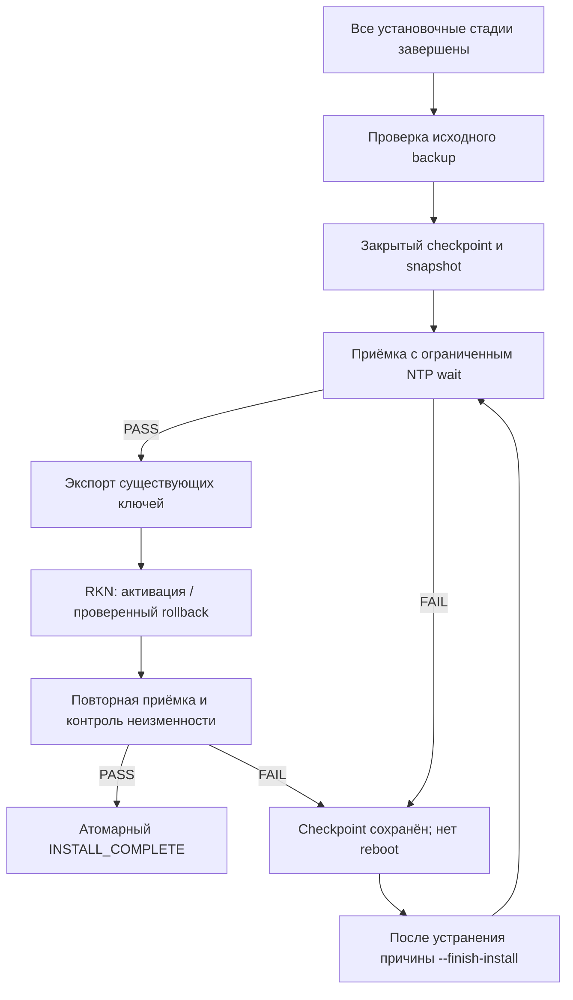

# ⏱️ Node_Install 2.5.6 — NTP, финальная фаза и честная диагностика

Дата: 09.10.2026. Основа: GitHub `8780852ac1adc15293758aae2d8ce1b7584b0380` и полный архив 2.5.5 с обновлёнными README/Security. Изменяется код установщика, **не действующие серверы**.

## 🔎 Подтверждённая причина отказа приёмки

В предоставленной оператором установке 2.5.5 initial NTP check был успешен. Далее журнал содержит запуск timesyncd в 19:56:06, финальную проверку около 19:56:27–35, ошибку `TIMESYNCD_NO_IPV4_TIME_SOURCE` и успешную новую синхронизацию в 19:56:37. Код 2.5.5 делал один probe в `--preboot`, без первоначального 120-секундного ожидания. Сохранились `INSTALL_FAILED`, отсутствие `INSTALL_COMPLETE`, невыполненные RKN-активация и экспорт ключей. Позже та же приёмка прошла без изменения NTP-конфигурации; узкое recovery завершило установку.

Это подтверждает гонку финальной проверки и повторной синхронизации. **Инициатор многочисленных перезапусков в исходном журнале не установлен.** APT/needrestart/unattended upgrades — возможный механизм, но не доказанная причина именно этого сервера. Не отключаем обновления и не переустанавливаем NTP ради предположения.

В более позднем аудите 2.5.5 NTP, Xray TCP/443, Selfsteal и RKN проходят проверки; значит, рабочую схему Nginx/RAW/XHTTP менять для этой ошибки не требуется. Отдельно выявлена частичная FD-диагностика `verified=false`, не отражённая старым внешним audit-wrapper в сводке нулевых кодов.

## 🩹 Что исправлено

| Участок | Было | Стало |
|:--|:--|:--|
| NTP preboot | Одно наблюдение | Общий монотонный deadline 120 s, два последовательных успешных наблюдения |
| NTP postboot | Wait 35 s, результат игнорировался, затем probe | Обязательный wait 120 s с результатом и без `|| true` на подтверждении NTP |
| Обычная проверка | Одно наблюдение | До 35 s на стабилизацию, тот же строгий критерий |
| Служба времени | Могла получить FAIL до повторной готовности | Состояние учитывается внутри ограниченного NTP-ожидания |
| Доказательство синхронизации | Активность, глобальный флаг, IPv4 и marker | Дополнительно принятый NTPMessage и неизменный InvocationID |
| Повтор после финального отказа | Повтор установочных стадий либо отдельный recovery | Replay только собственного записанного финального checkpoint 2.5.6 |
| Фиксация успеха | Обычная запись marker | Атомарная эксклюзивная публикация, восстановимый commit/cleanup |
| Частичные ресурсы | JSON мог иметь `verified=false` при rc=0 | `review_summary`; опциональный `--strict` возвращает 2 |

Ожидание не является безусловным `sleep 120`: при двух успешных наблюдениях завершается раньше. Любая ошибка, смена invocation или выбранного сервера сбрасывает серию. Нет бесконечных retries, автоматической смены NTP-сервера, выключения IPv6-контроля или подделки PASS. Проверка настоящего NTP-пакета требует `PacketCount>0`, `Ignored=no`, нормального/ожидаемого leap-индикатора, server mode 4 и stratum 1–15. Старый marker после restart недостаточен.

Chrony не заменяется на timesyncd и наоборот. Его прежние условия синхронизации сохранены; дополнительно проверяется стабильная invocation. Частные IPv4 NTP-серверы провайдера не запрещаются и не заменяются публичными наугад.

## 🧭 Финальная фаза



Checkpoint разрешён только после создания необходимых файлов новой установки 2.5.6. Он включает hashes конфигурации, сохранённой REALITY identity, helpers, compose, pinned image и собственного snapshot, копию одобренного `install.sh` и исходного UFW before.rules. Проверка backup отказывается от path traversal, небезопасных ссылок, чужого владельца и испорченных сумм.

```bash
# Явное повторение только финальной фазы:
sudo bash /root/vkarmani-node-installer/install.sh --finish-install
```

При обычном повторном запуске той же версии с существующим finalization checkpoint срабатывает этот же путь, **до** APT/SSH/UFW/Docker/Nginx-настройки. Запрещено попутно менять image или расписание weekly reboot. Автоматического reboot при продолжении нет. Snapshot/ключи не выводятся; хранить их приватно.

Если RKN уже был начат и процесс прерван, применяется только его штатный scoped rollback с проверкой исходного `before.rules`. Сбой RKN может дать DEGRADED, но лишь если rollback доказан и полная локальная приёмка после него PASS. Если не доказан — установка остаётся незавершённой. Системный UFW не сбрасывается; SSH/2222 и политика панели не расширяются.

После атомарного commit удаляются только связанные failure-markers; checkpoint сохраняется для аудита. Повтор finish на уже завершённом собственном checkpoint не пересоздаёт контейнер, ключи или RKN. Это не универсальная транзакция всей ОС и не rollback пакетов.

## 🚫 Что не мигрируется

Незавершённая 2.5.5 без нового checkpoint и произвольные старые/чужие состояния намеренно отклоняются. На операторской ноде из журнала 2.5.5 recovery уже выполнен: **не повторять** его и не устанавливать 2.5.6 поверх рабочей VPS. Код новой версии не называется установленным на старом сервере после простой замены архива в Git.

## 📊 Ресурсы и внешний audit-wrapper

```bash
sudo bash install.sh --diagnose-resources --seconds 10 --strict
```

Default без `--strict` по-прежнему выдаёт JSON и rc=0 при успешном сборе ради совместимости. Теперь в JSON есть `review_summary` с `review_required`, `finding_count`, `findings` и `status`. С `--strict` rc=2 означает неполные данные или предупреждение/критическое значение. Это не команда исправления.

Отсутствующий/исчезнувший процесс, недоступный `/proc/PID/fd`, пустой список целевых процессов и ограниченный scan не превращаются в «нет проблемы». Остановленный контейнер не получает OK только по отсутствию OOM. Исходные детали сохраняются. Часть снимка может быть полезной при общем REVIEW_REQUIRED.

Старый отдельный `VKARMANI_SPITE_FULL_AUDIT_RO_20261009.sh` из переписки сам не обновляется установщиком: этот файл не являлся частью репозитория. Для автоматизированного учёта новых результатов используйте `--strict` или читайте `review_summary`; исправленная отдельная редакция внешнего аудита прилагается к ответу отдельно, не включается в публичную runtime-конфигурацию нод.

## 🧪 Проверка и реальные границы

Регрессионные тесты работают с реальными embedded payloads, синтетическими systemd/DBus ответами и временной файловой системой. Есть воспроизведение окна 21→31 секунда, persistent outage, IPv6 вместо IPv4, stale marker, нулевой/игнорированный NTPMessage, смена invocation и deadline, повтор финализации после NTP-отказа, RKN failure/rollback failure, изменение ключей/профиля/image, unsafe links, ошибки backup/commit, идемпотентность и частичная resource-сводка.

Полные числа и результаты текущего запуска находятся в [TEST_REPORT](TEST_REPORT.md) и [RELEASE_VALIDATION](RELEASE_VALIDATION.json). Локальная проверка не является установкой на Ubuntu 22.04/24.04/26.04, Debian 12/13, реальным kernel firewall test, новой перезагрузкой VPS или клиентским тестом. Контейнер и настоящие systemd NTP-службы на VPS этим выпуском не менялись.

## 📦 Внедрение, backup и rollback

Для **новой canary VPS**: snapshot → проверка доступа к snapshot/recovery и второго парольного SSH → распаковка полного архива → `sha256sum --check SHA256SUMS` → `bash -n install.sh` → `sudo bash install.sh --no-reboot` → проверка панели и клиента → отдельная контролируемая перезагрузка → проверка загрузки и таймеров. До публикации двух локальных release-коммитов в GitHub команда из README с новым pinned SHA закономерно не сможет скачать выпуск; используйте архив, не ослабляйте SHA-проверку.

После успешной установки:

```bash
sudo bash /root/vkarmani-node-installer/install.sh --check --require-xray
sudo bash /root/vkarmani-node-installer/install.sh --rkn-status
sudo systemctl list-timers --all --no-pager vkarmani-rkn-update.timer certbot.timer
sudo bash /root/vkarmani-node-installer/install.sh --diagnose-resources --seconds 10 --strict
```

Путь `/root/vkarmani-node-installer/install.sh` создаёт верхняя команда README. При локальной установке из распакованного архива вместо него используйте полный путь к своему `install.sh`; checkpoint содержит отдельную root-only копию в `/var/lib/vkarmani-node/finalization/installer.sh`.

Восстановление при доказанном временном NTP-отказе — только finish по сохранённому checkpoint. При повреждённых hashes, чужом image, изменённых ключах, NTP outage дольше deadline или неподтверждённом UFW rollback не стирать markers: сохранить закрытый backup/журналы и разбирать через консоль. Полный откат новой VPS — проверенный snapshot хостера; **не** повторный запуск установщика старой версии поверх нового состояния. Git-rollback исходников не откатывает сервер.

## 📚 Источники и upstream review

- Перед сборкой прочитан актуальный `main` Node_Install: `8780852ac1adc15293758aae2d8ce1b7584b0380`.
- `Flecksis/rkn-guard/master`: `34ed9c13bfa1280d32226164084da25b33a4c155`, без изменений относительно рассмотренной интеграции. Автообновление кода не включалось.
- Источник данных `shadow-netlab/traffic-guard-lists/main`: `7b9623238d7420cbb31feaa149610738feb45fd5`, без изменений относительно предыдущего review. Реальный запуск нового ежедневного таймера этим код-аудитом не проверяется.
- [systemd-timesyncd.service](https://www.freedesktop.org/software/systemd/man/systemd-timesyncd.service.html): готовность службы и действительная синхронизация — разные состояния, роль `/run/systemd/timesync/synchronized`.
- [systemd v249 timedatectl.c](https://github.com/systemd/systemd/blob/v249/src/timedate/timedatectl.c): проверен машинный вывод NTPMessage, включая формат `Ignored=no PacketCount=...` без запятой; парсер допускает оба представления. Это проверка исходников, не живой systemd 249.
- [Ubuntu: automatic updates](https://ubuntu.com/server/docs/how-to/software/automatic-updates/): пакетные обновления и needrestart могут перезапускать затронутые службы. Это общее объяснение допустимого поведения, не доказательство конкретного инициатора в исходном инциденте.

Следующая сборка вновь должна проверить эти upstream-репозитории и changelog. Чужой исполняемый код не подкачивается в root-runtime автоматически.
